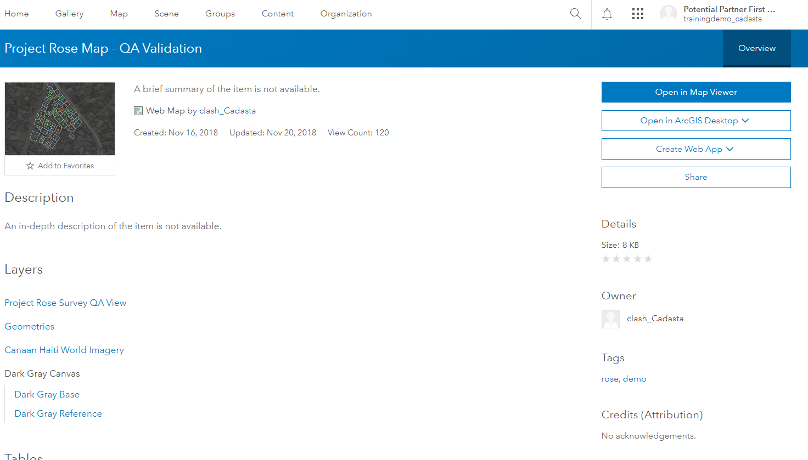
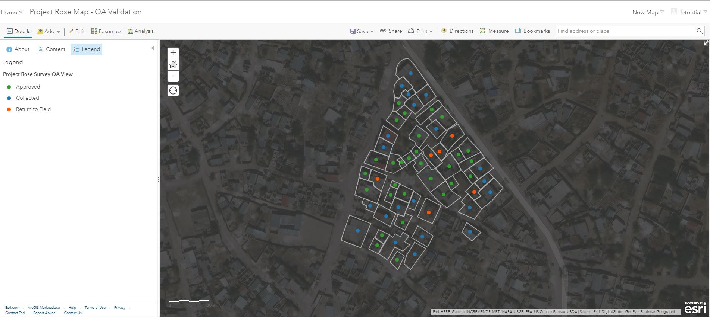

1. Navigate to the desired Web Map and press the **Item Details** button

1. Press the **Open in Map Viewer** button

1. See the **Web Map** 

1. Click **Content** 

1. Click the **Show Table** icon  
 under the desired layer

    <small>Note: This example uses the Pradan geometry - Polygon layer</small>

1. See the **Table View**

1. Click **Options** 

1. Click **Add Field**

    

2. Fill out the contents of the field values 

    <small>Note: This example uses double type for its numerical field for area in hectares</small>

    

1. Click **Add New Field**

1. See the new Field in the **Table**

    <small>Note: This example uses the Hectares field</small>

    

1. Click on the field name, **Hectares**

1. Click on **Calculate**

    

1. The **Calculate Field** window appears

1. Fill out the **SQL Expression**

    Expression: POWER(Shape__Area,2)/10000
    
    Explanation:	The Shape_Area field is in square meters. In order to convert meters to hectares, 
you must base the expression on the following equation: Ha = m2/1,000

    

1. Click **Calculate**

1. See that the Hectares field has been calculated

