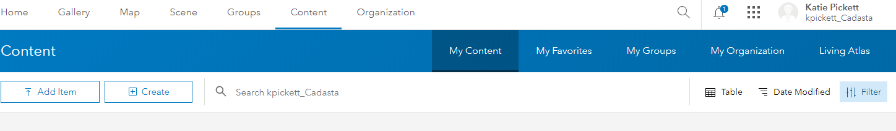
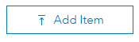
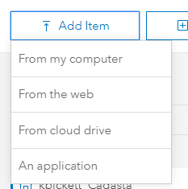
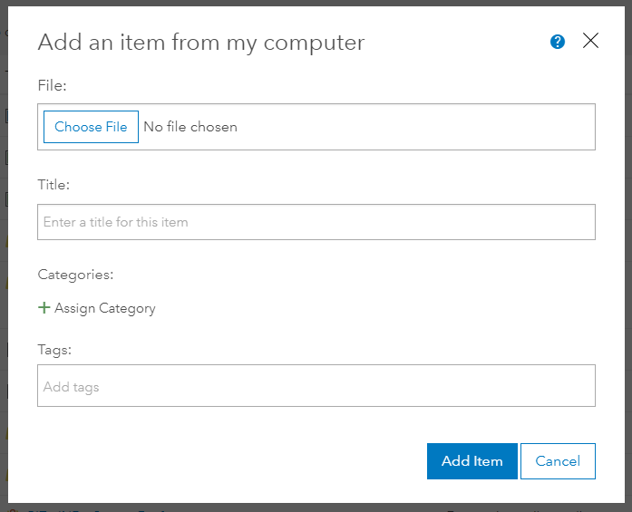
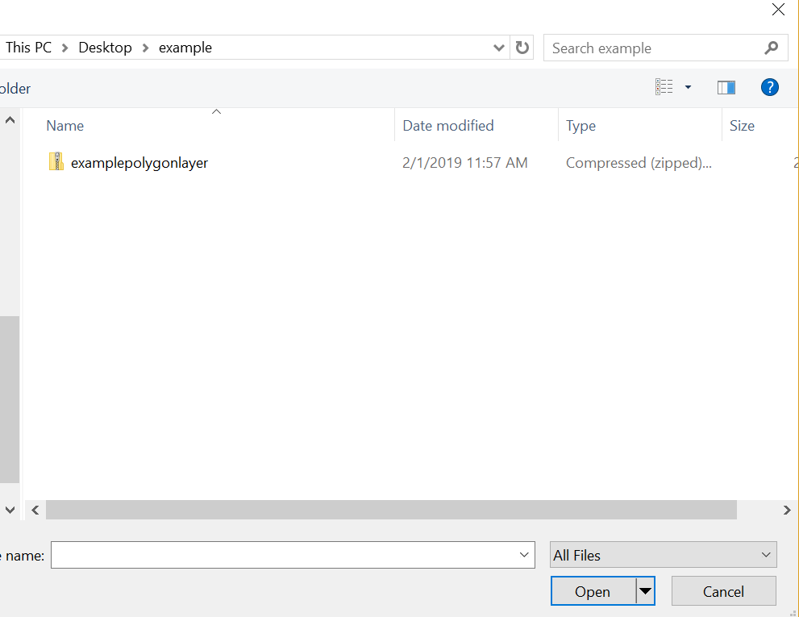
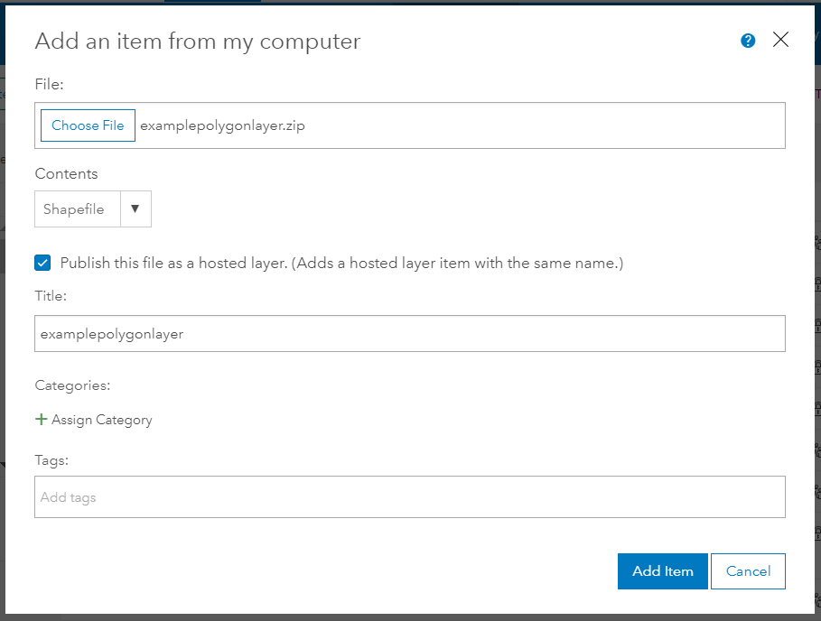
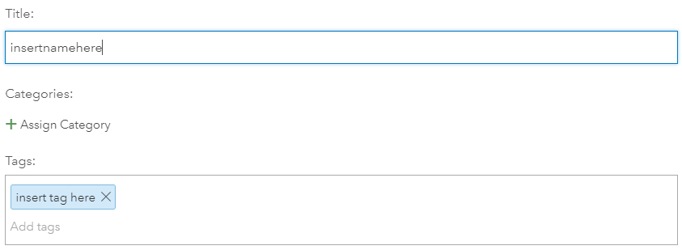

1. After logging into your ArcGIS Online account, press the "Content" tab and then select "My Content"
    
    
 1. Press the "Add Item" button 
   
    

2. Select the "From my computer" option
   
   

3. See the splash window, *Add an item from my computer*, appear
   

4. Press the "Choose File" button
   
5. Navigate to a **zipped shapefile folder**
   
   

6. Rename and add **Tags** to the new item

    
    

7. Press the "Add Item"button

