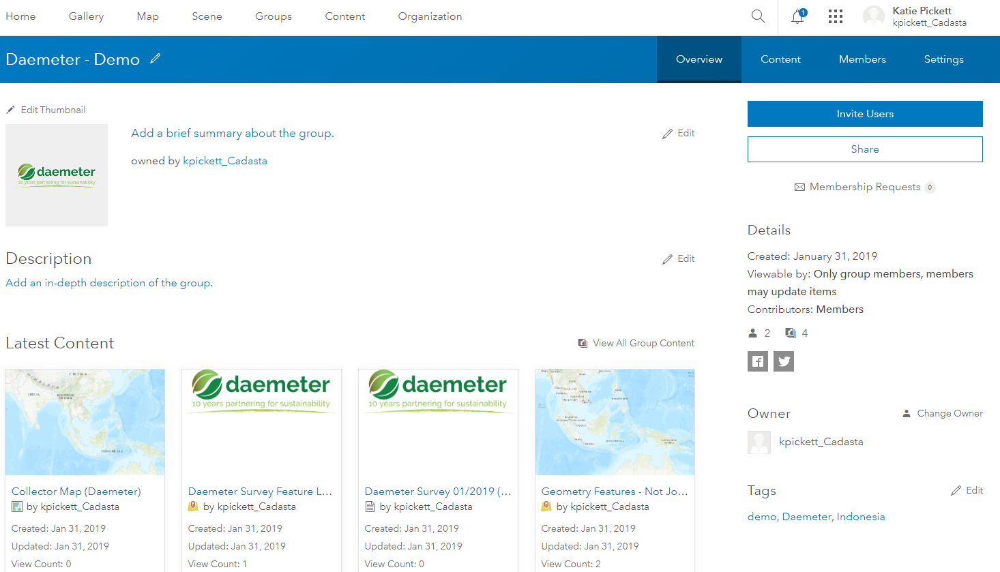
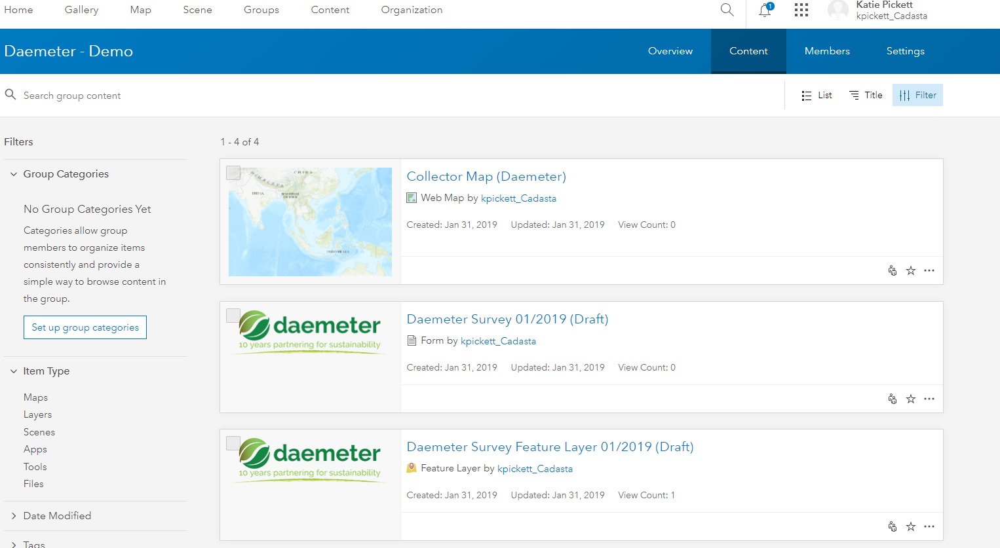
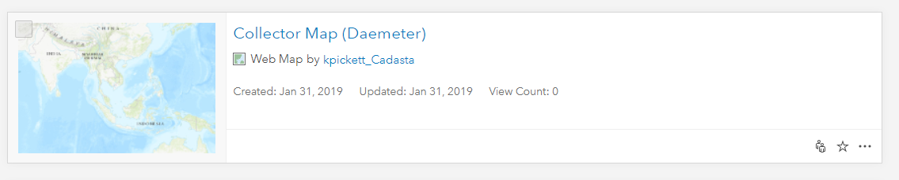
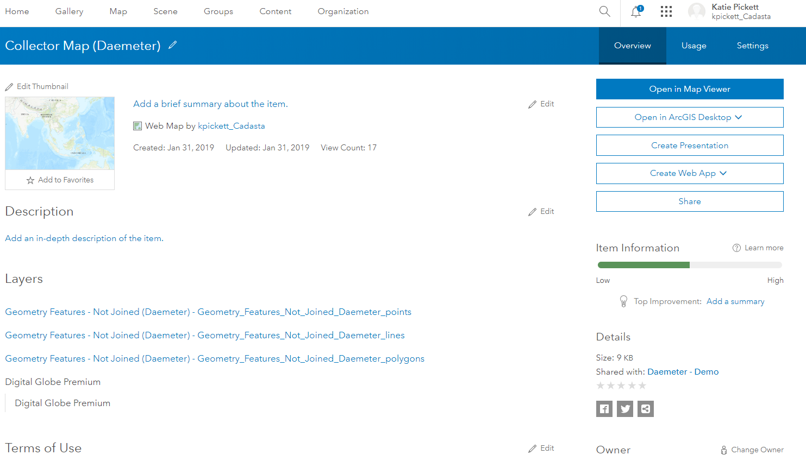
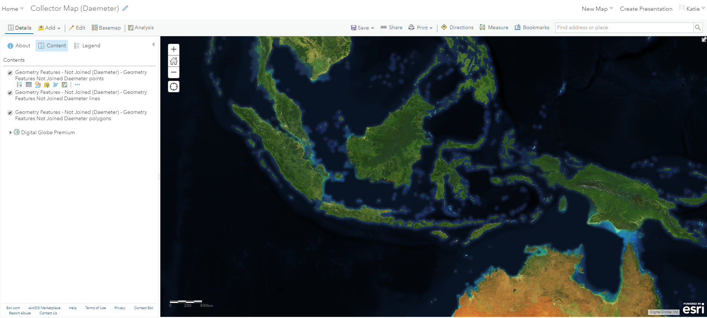
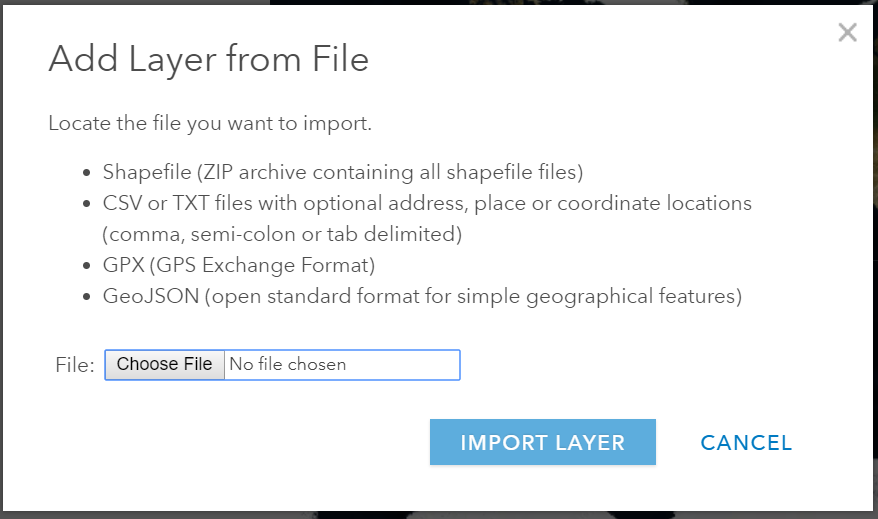
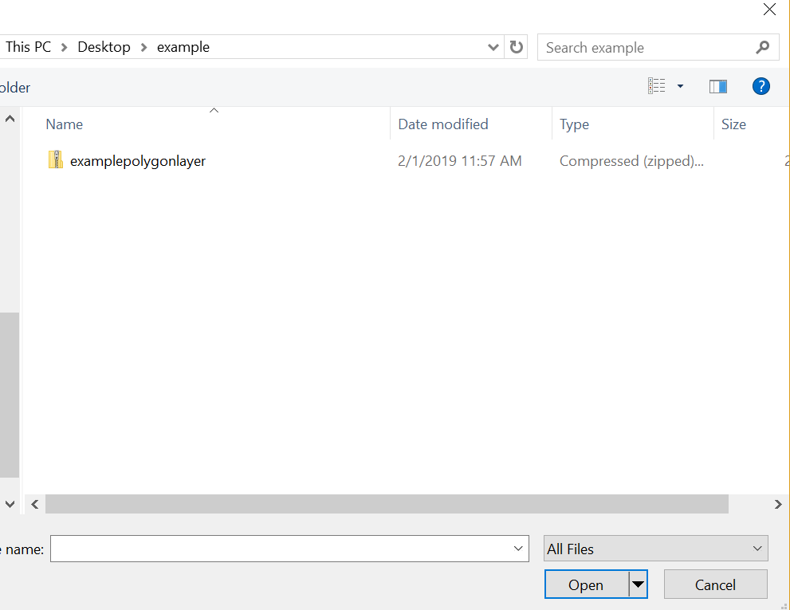
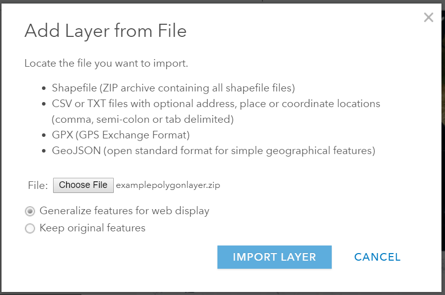
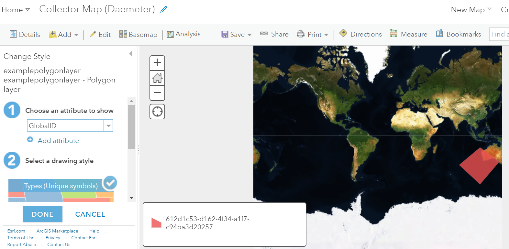
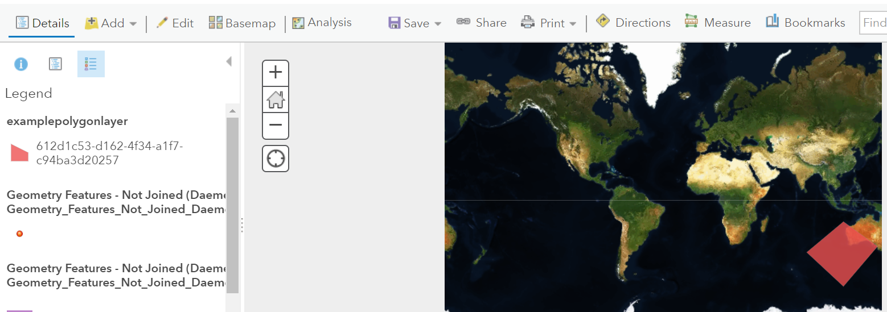

<u>**Purpose**</u>

This page will explain how to add a feature layer from a file to a Collector web map in ArcGIS Online (AGOL)

<u>**Requirements**</u>

* You will need to have a username and password set up for you by a Cadasta team member. If you do not have a user please contact support@cadasta.org
* You will need to sign to your account - see [Introduction to your account](intro_to_account/index.md) for a reminder

-----

<u>**Steps**</u>

1. In AGOL, navigate to your Group page
   

1. Press the "Content" tab in your Group


1. Find and select your Collector Map (Organization Name)

1. Press the "Open in Map Viewer" button

1. See the Map Viewer with the Collector Map (Organization Name)


1. Press the "Add" button


1. Choose "Add Layer From File"
   <small>*Note: There are different options available, including, from layers*</small>

1. Press the "Choose File" button.
    <small>Note the rules for files in the splash screen</small>
1. Navigate to a zipped shapefile folder 

1. Press the "Import Layer" button


1. Symbolize, or stylize, the layer 

1. Press the "Done" button

1. See the new layer in the Legend

1. Press the "Save" button
   
   

