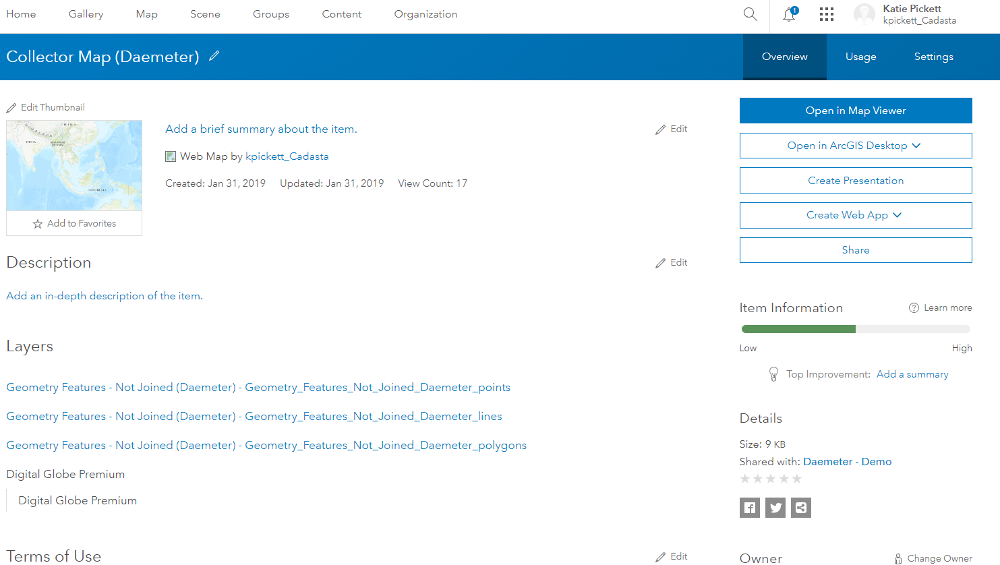
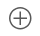
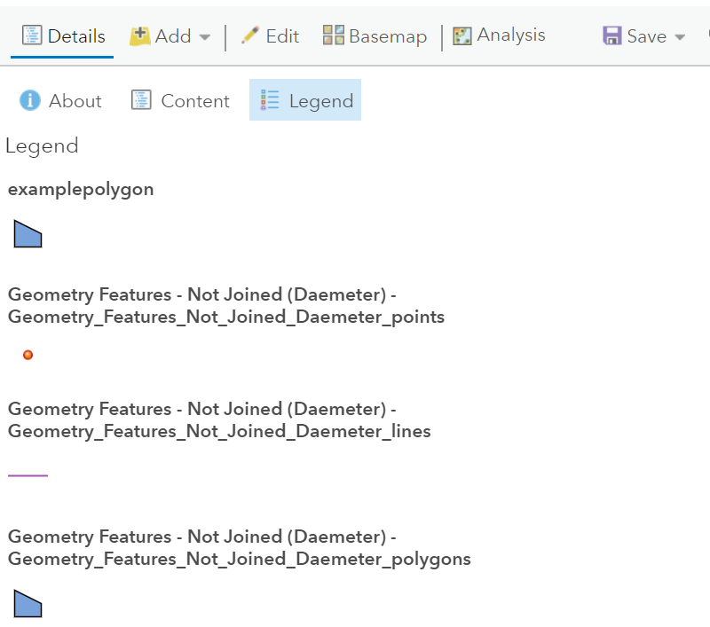

## Purpose

This page will explain how to add a feature layer to a Collector web map in ArcGIS Online (AGOL)

## Requirements

* You will need to have a username and password set up for you by a Cadasta team member. If you do not have a user please contact support@cadasta.org
* You will need to sign to your account - see [Introduction to your account](intro_to_account/index.md) for a reminder

-----

## Steps

1. In AGOL, navigate to your Group page
   

1. Press the "Content" tab in your Group


1. Find and select your Collector Map (Organization Name)

1. Press the "Open in Map Viewer" button

1. See the Map Viewer with the Collector Map (Organization Name)


1. Press the "Add" button

    

1. Choose "Search for layers"
   <small>*Note: There are different options available, including, from file*</small>

1. Type in the name of the layer in the search section.
    <small>*Note: examplepolygon was used in this example*</small>
    
1. Select the plus icon to add the layer

2. See that the new layer *example polygon* has been added and is present in the Legend


3. Press the "Save" button

   

