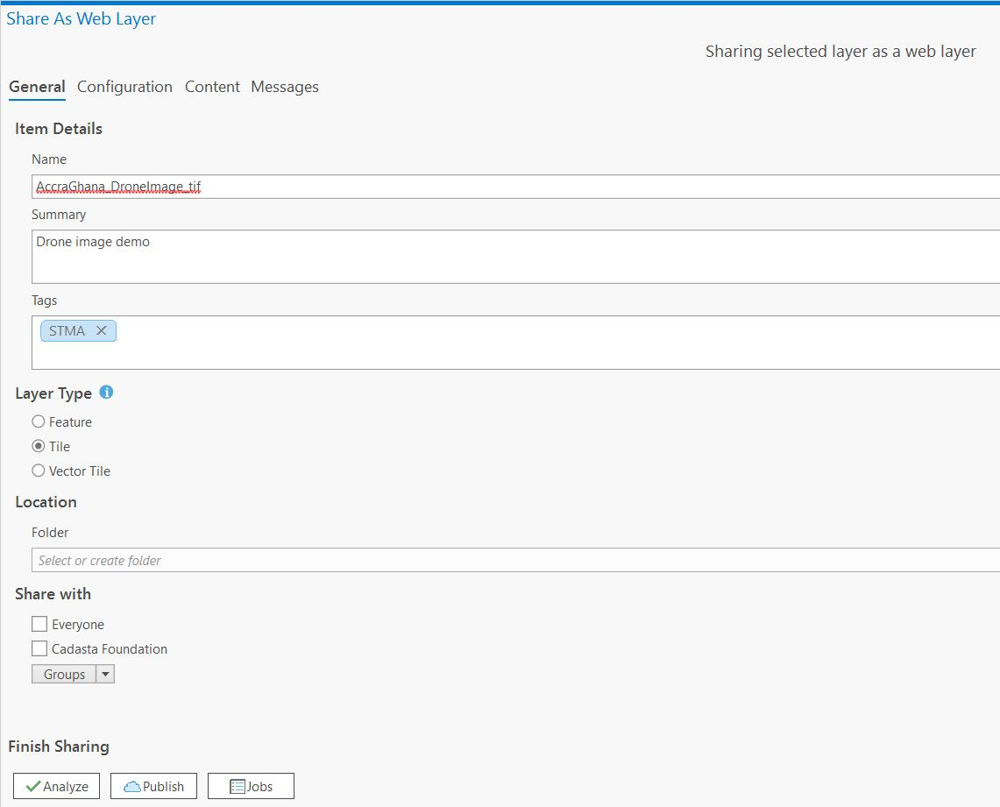
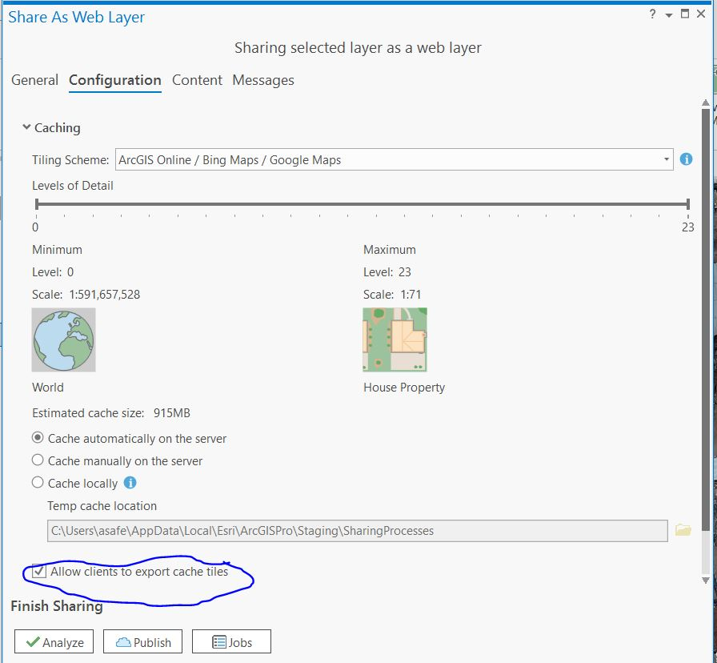

## Purpose

This page will explain how to upload an orthomosaic file to your account on ArcGIS Online (AGOL)

## Requirements

* You will need to have a username and password set up for you by a Cadasta team member. If you do not have a user please contact support@cadasta.org
* You will need to sign to your account - see [Introduction to your account](intro_to_account/index.md) for a reminder
* You will need to have an Esri license for ArcMap or ArcGIS Pro and have it installed on your workstation

-----

## Steps

1. Open ArcMap or ArcGIS Pro
2. Open the drone image
3. Right click the image layer and select Share -> as Web Layer

1. In the "Layer type" section, select the “Tile” option
2. In the "Share with" section, make sure that you share the new layer with the appropriate group.

3. Go to the “Configuration” tab and make sure that the “levels of detail” slider is set to its maximum value (level 23) and that the "Allow clients to export cache tiles" checkbox is turned on

