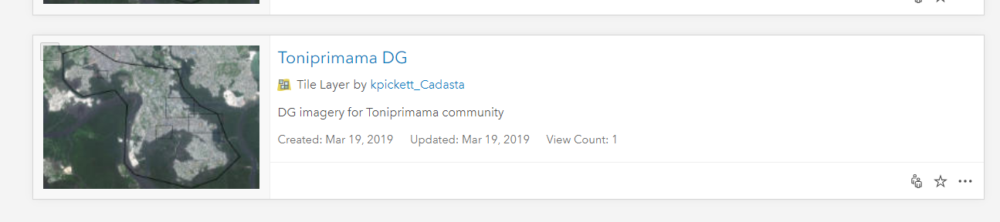
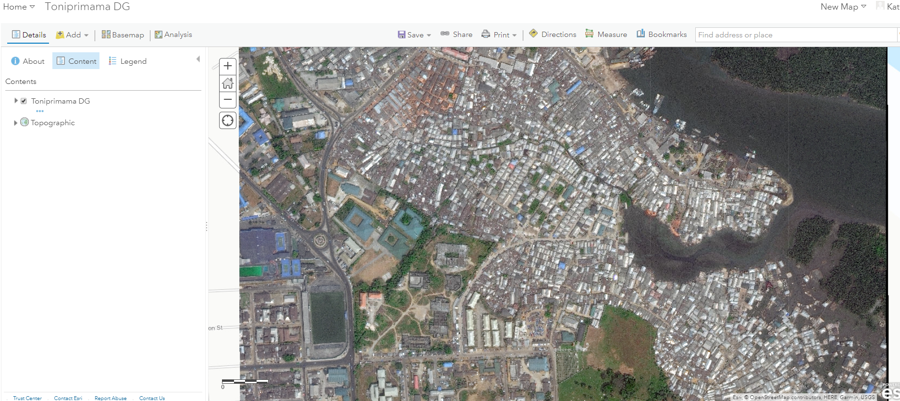
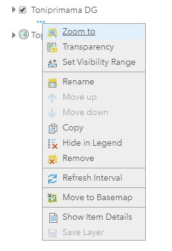
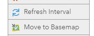
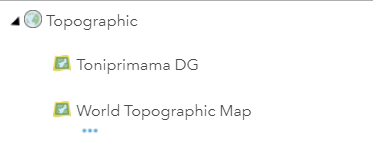
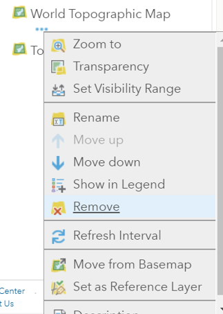

## Purpose

This page will explain how to add a tile layer as a basemap to your web map on ArcGIS Online (AGOL)

## Requirements

* You will need to have a tile layer and a web map already created on AGOL

-----

## Steps

1. Navigate to your desired Tile Layer in AGOL

    *Note: It should be located in the User Group*

    

1. Open your Tile Layer in the Map Viewer OR Add the Tile Layer in your existing Map Viewer

    

1. Select **More Options** for the Tile Layer

    

1. Select **Move to Basemap**
   
    

1. The result of moving the Tile Layer to a Basemap will look like this

    

1. If you have two Basemaps, please remove the undesired Basemap by selecting **More Options** and **Remove**

    

1. Save the Web Map
