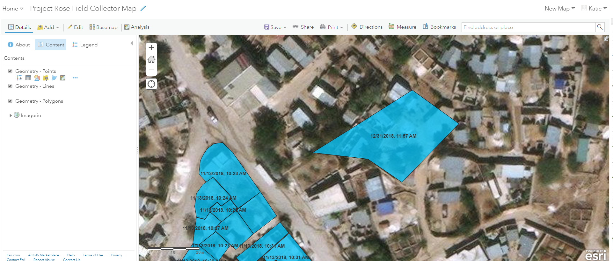
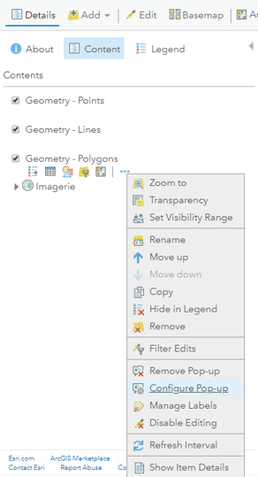
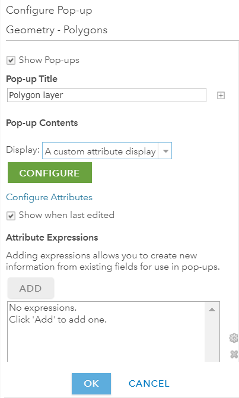
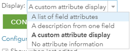
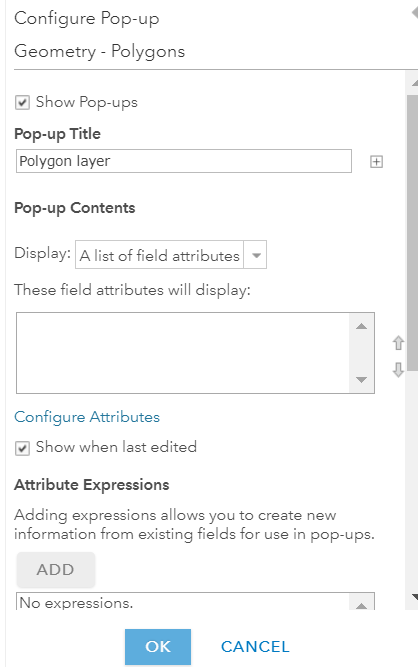
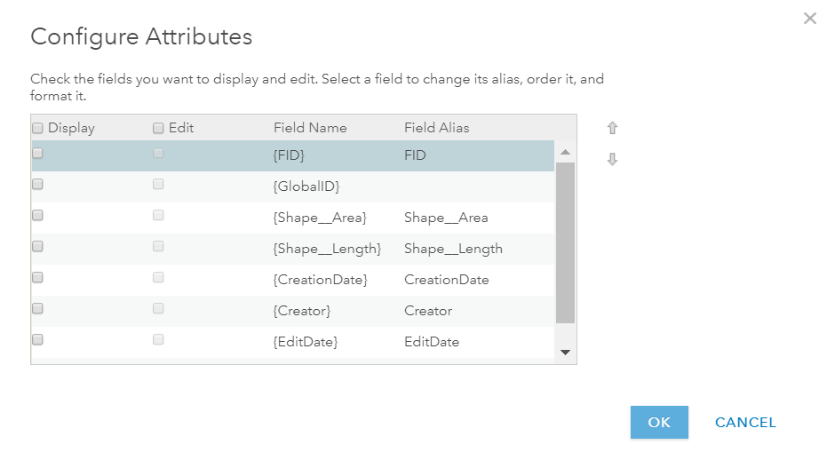
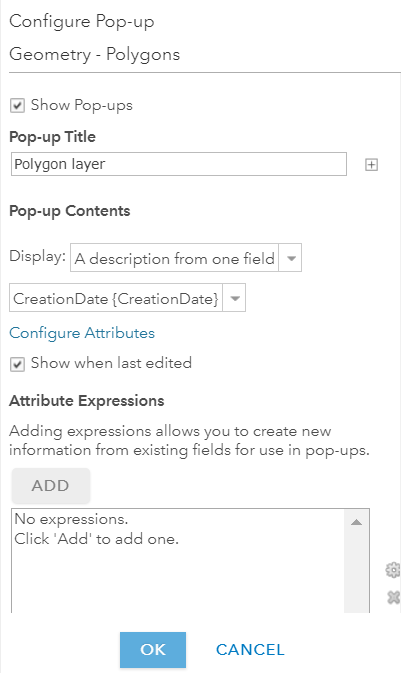
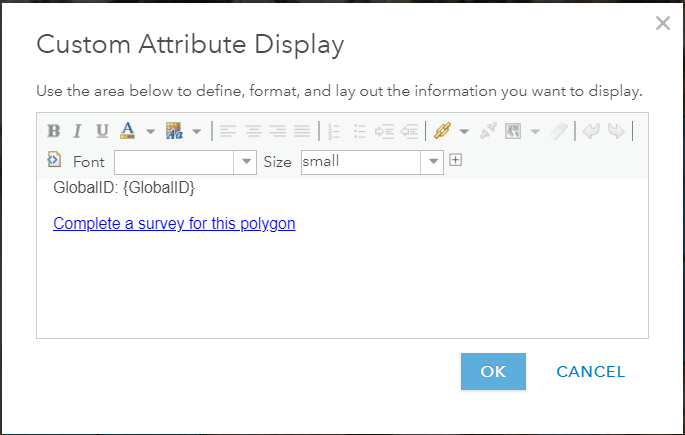
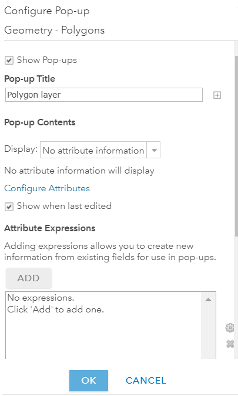

<u>**Purpose**</u>

This page will explain how to add pop-ups in a web map in ArcGIS Online

<u>**Requirements**</u>

* You will need to have a username and password set up for you by a Cadasta team member. If you do not have a user please contact support@cadasta.org
* You will need to sign to your account - see [Introduction to your account](intro_to_account/index.md) for a reminder

-----

<u>**Steps**</u>

1. Navigate to your desired map in the Map Viewer

    

2. Click **More Options**  

3. Click **Configure Pop-up** 
   
   

4. See the **Configure Pop-up** sidebar

    

5. Choose an option from the **Display** drop-down

    

6. If you chose **A list of field attributes** follow these steps:

    

   1. Select **Configure Attributes**

   2. Check the boxes next to the attributes that you wish to display

        

   3. Press **OK**

   4. Press **OK**

---------------------------------------------------------------------------------------------------

If you chose **A description from one field** follow these steps:

   1. Select the desired attribute from the **Attributes** drop-down 
   2. Press **OK**

---------------------------------------------------------------------------------------------------

If you chose **A custom attribute display** follow these steps:

1. Click **Configure**

1. See **Custom Attribute Display** window

1. Fill out content as desired

1. Press **OK**

1. Press **OK**

---------------------------------------------------------------------------------------------------

If you chose **No attribute information** follow these steps:

   1. Press **OK**
   2. Press **Save**

