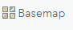
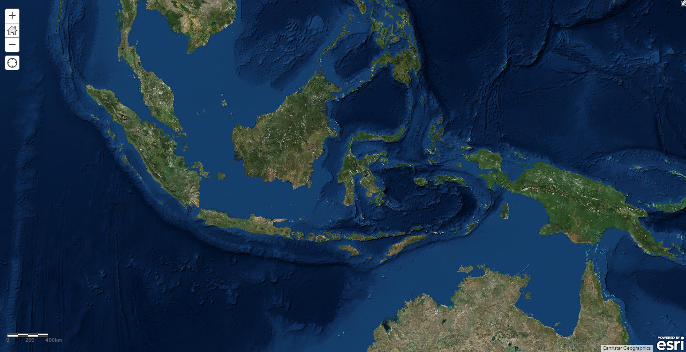
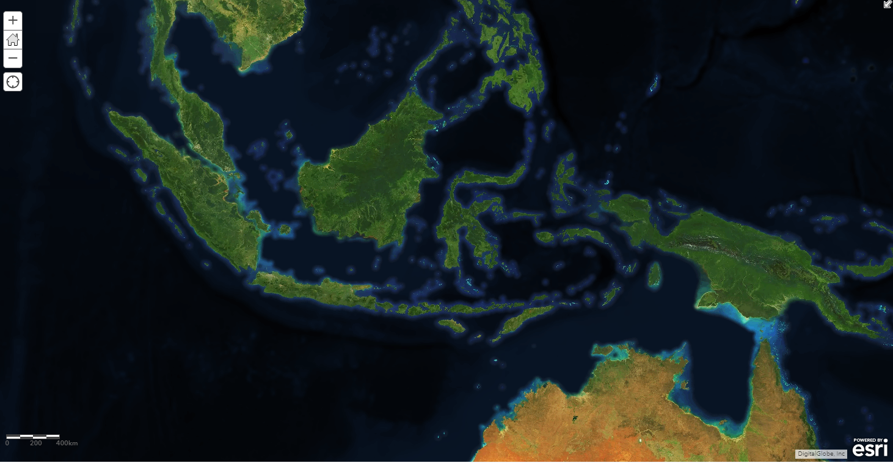
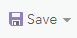

## Purpose

This page will explain how to change a basemap for a web map  in ArcGIS Online (AGOL)

## Requirements

* You will need to have a username and password set up for you by a Cadasta team member. If you do not have a user please contact support@cadasta.org
* You will need to sign to your account - see [Introduction to your account](intro_to_account/index.md) for a reminder

-----

## Steps

1. In AGOL, navigate to your Group page

1. Press the "Content" tab in your Group page


1. Find and select your Collector Map (Organization Name)

1. Press the "Open in Map Viewer" button

1. See the Map Viewer with the Collector Map (Organization Name)


1. Press the "Basemap" button
   

1. Choose your desired Basemap
<small>
 *Note see the difference in the two Basemaps*</small>

1. Press the "Save" button

    

