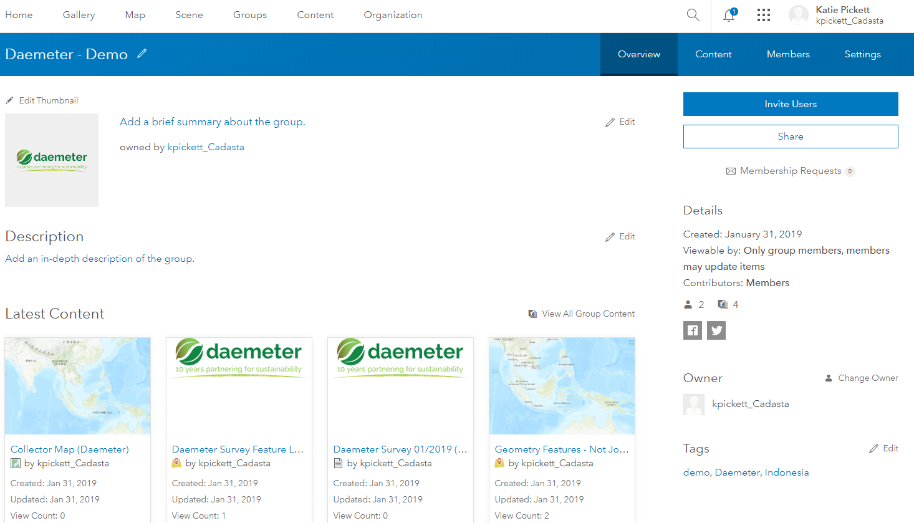
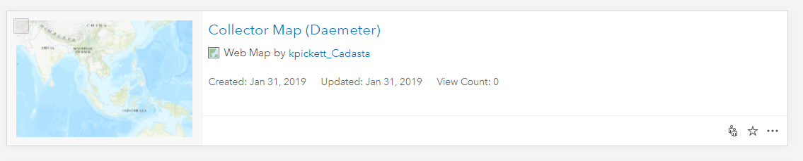

1. In AGOL, navigate to your Group page

1. Press the "Content" tab in your Group page


1. Find and select your Collector Map (Organization Name)

1. Press the "Open in Map Viewer" button

1. See the Map Viewer with the Collector Map (Organization Name)


1. Press the "Basemap" button  
   

1. Choose your desired Basemap
<small> 
 *Note see the difference in the two Basemaps*</small>

1. Press the "Save" button 
 
    

