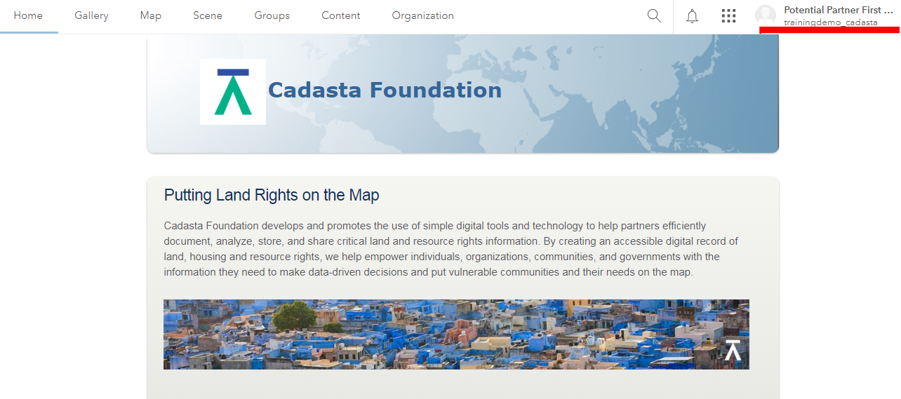
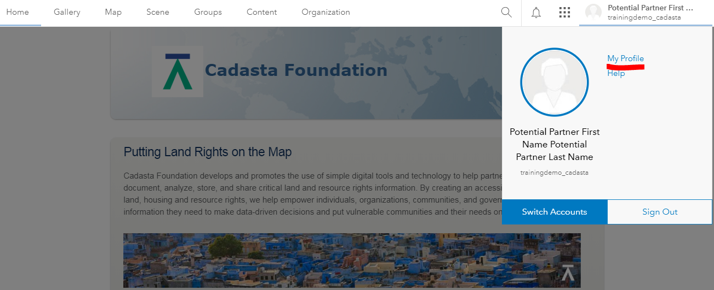
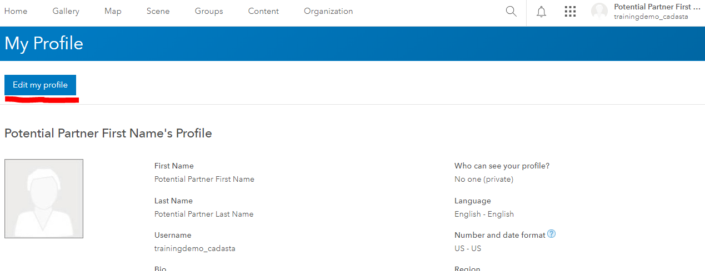
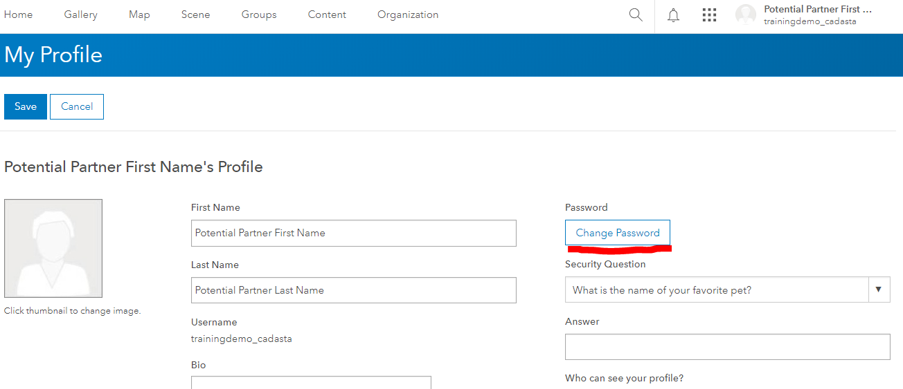
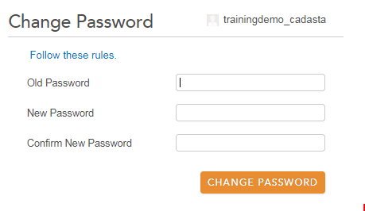
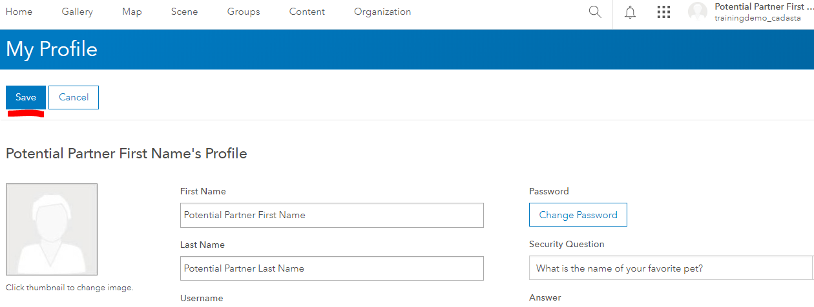

### Purpose

This page will explain how to change the password of your ArcGIS Online (AGOL) account

### Requirements

* You will need to have a username and password set up for you by a Cadasta team member. If you do not have a user please contact support@cadasta.org

-----

### Steps

1. Sign in to ArcGIS Online (AGOL)
2. Select "User Name" in the top-right corner of the page:

1. Select "My Profile"

1. Select "Edit my profile"

1. Select "Change Password"

1. Change password and select "Change Password" in the new screen

1. Select Save

1. Sign out of your User account
