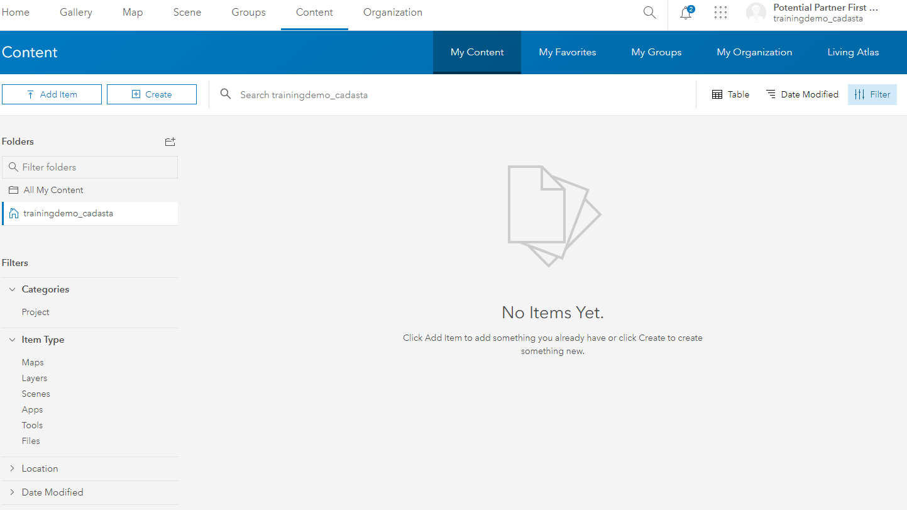
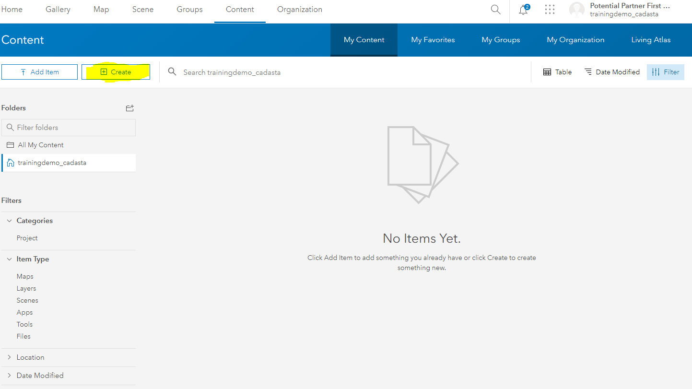

## Purpose

This page will explain how to create a new feature layer to be used in the Collector mobile app.

## Requirements

* You will need to have a username and passowrd set up for you by a Cadasta team member. If you do not have a user please contact support@cadasta.org

---

## Steps

1. Log in to your user account in AGOL.
1. Navigate to **Content**, **My Content**
   

1. Create a new **Feature Layer** by selecting **Create**

1. Select **Feature Layer**
   
1. Select **Build a Layer**
  

1. Select **Polygon** and **Create**

  
1. Select **Next** and **Next**
2. Enter a **Title** and **Tags**. Other information is optional. 
 
1. Select **Done**