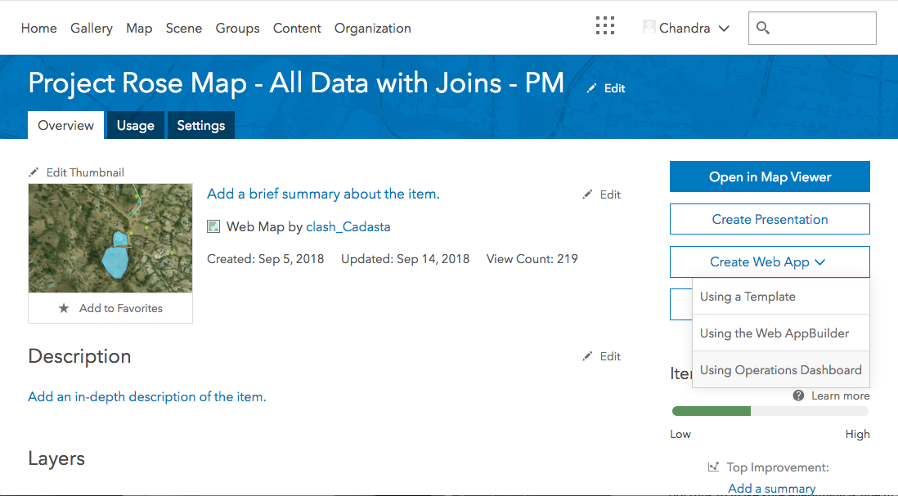
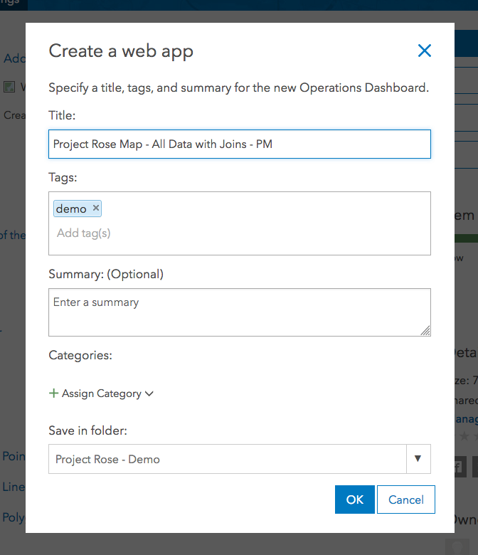
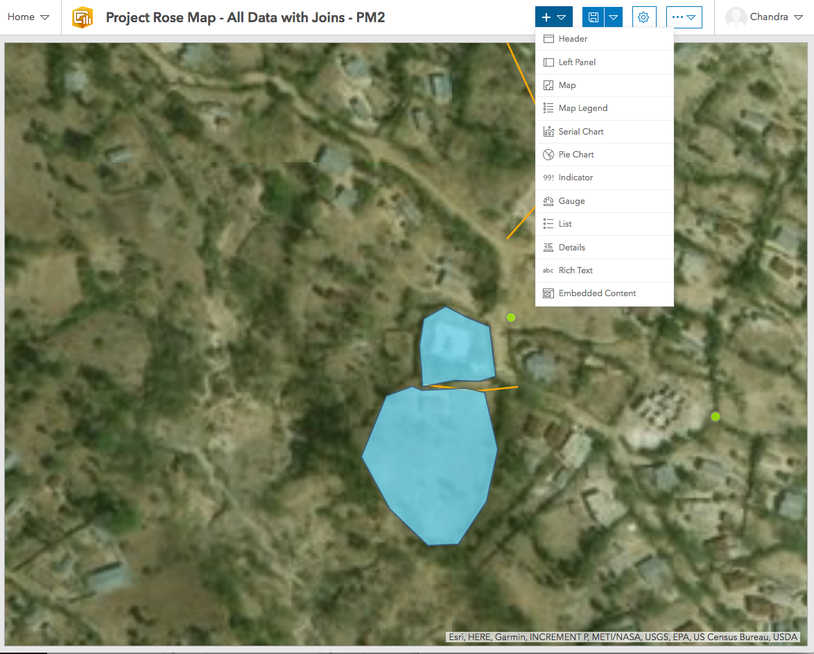
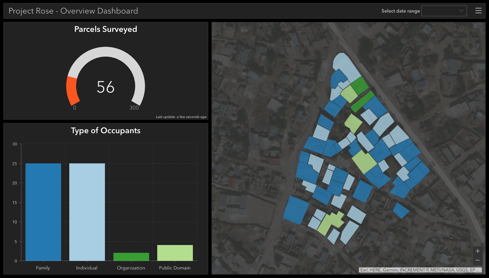
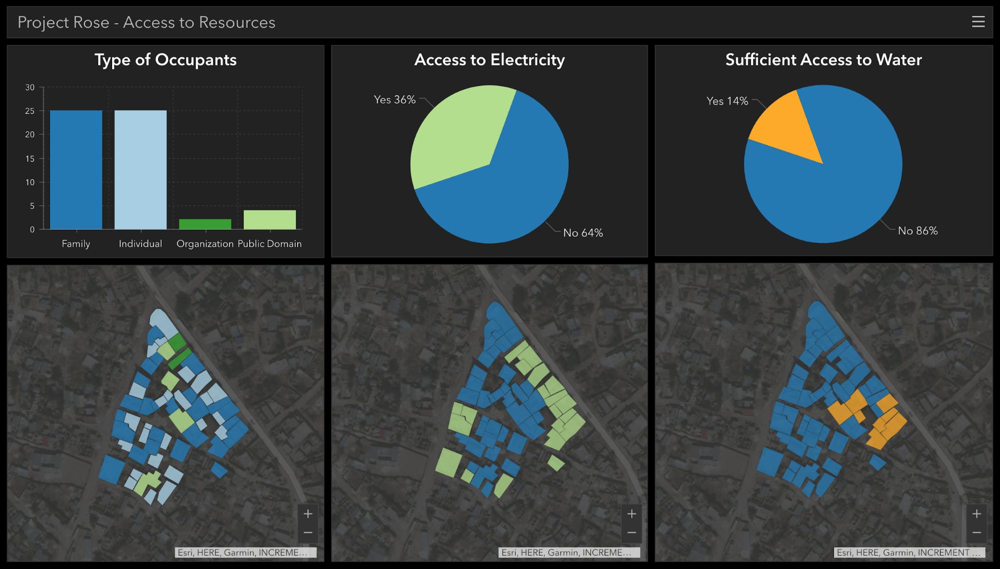
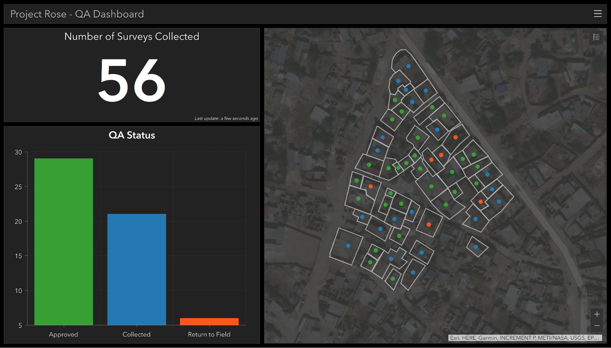

## Purpose

These steps will explain how to create a new Operations Dashboard in ArcGIS Online (AGOL) 

## Requirements
1. You will need to have an account on the Cadasta AGOL platform.
2. You will need to create a web map with all of the relevant data layers.

## Steps

1. In AGOL, go to the web map you have created.
2. Select **Create Web App** > **Using Operations Dashboard**. 

    

1. Input a title, tags, and summary and then the OK button when complete.

        
1. You will see your map with a top menu bar of options to configure your dashboard. These allow for configuration of both layout and content.

    

1. Add graphs and content to customize your dashboard. Select **Save** when complete. Depending on which layers you are basing your graphs off, you can see real-time updates of your project data collection. The demo project dashboards are [Project Rose - Overview Dashboard](https://arcg.is/0DSWjC), [Project Rose - Resource Metrics](https://arcg.is/19z5yH), [Project Rose - QA Dashboard](https://arcg.is/0a1WjT).
   
    
    
    
    
## Resources for Using Operations Dashboard

[Operations Dashboard Overview](https://www.esri.com/en-us/arcgis/products/operations-dashboard/overview)

[Gallery of Operations Dashboards](https://www.esri.com/arcgis-blog/products/ops-dashboard/decision-support/some-example-operations-dashboard-for-arcgis-apps-resources/)

