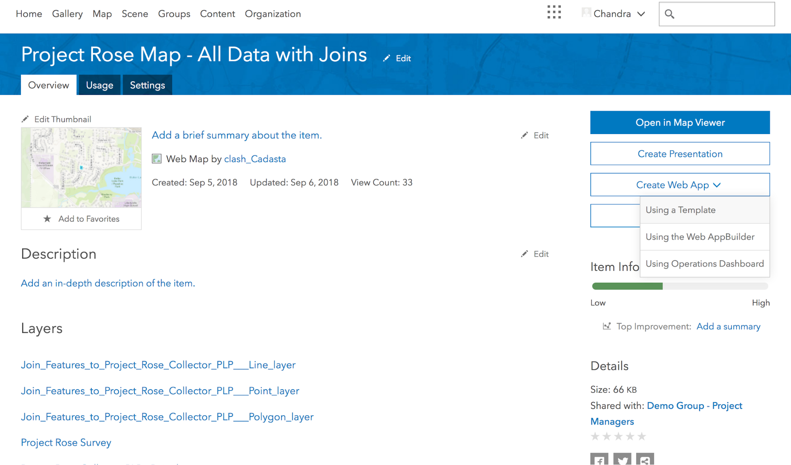
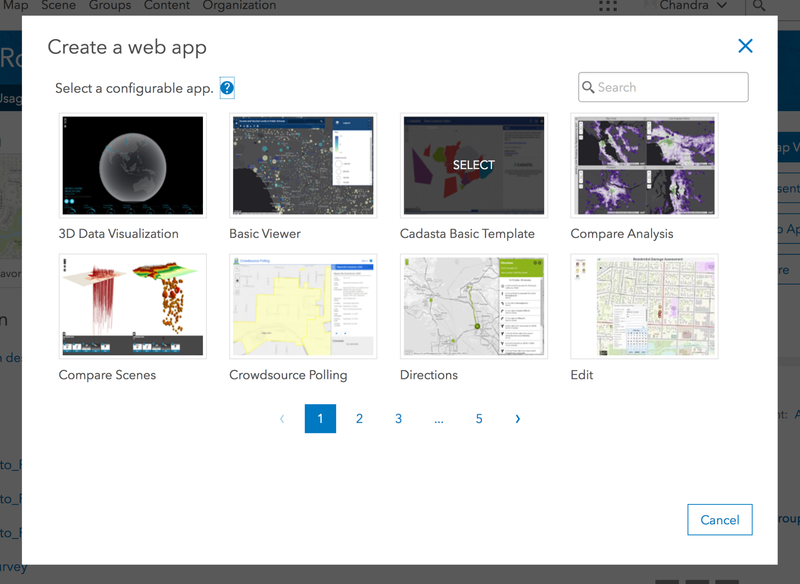
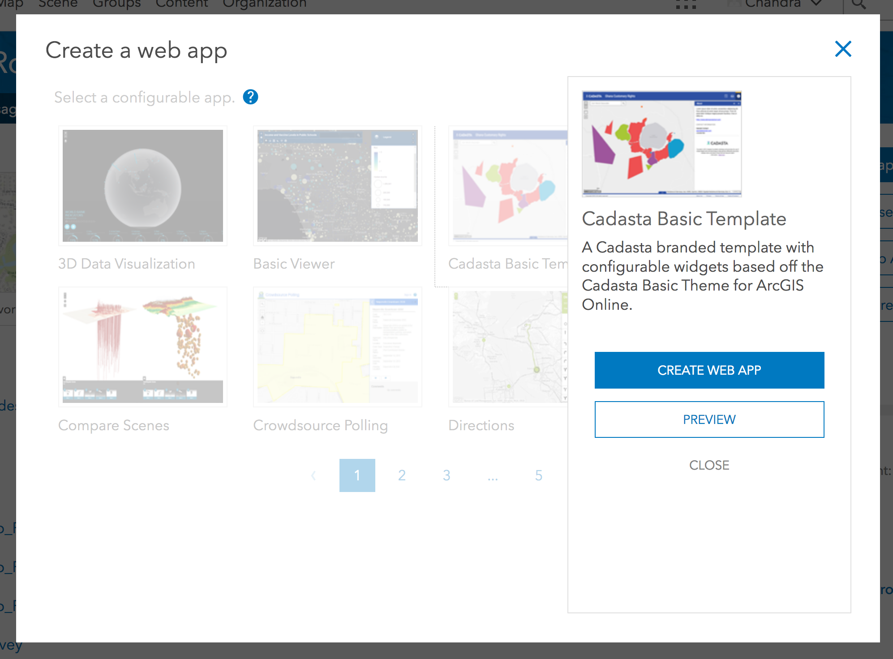
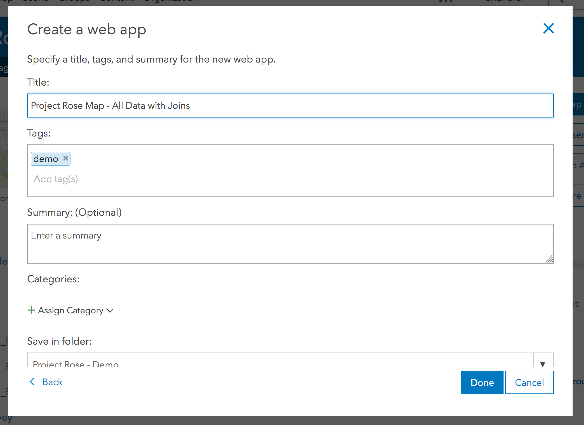
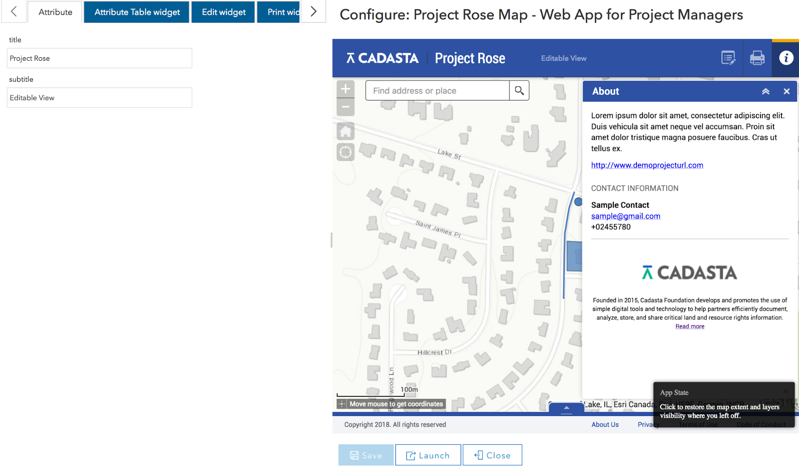
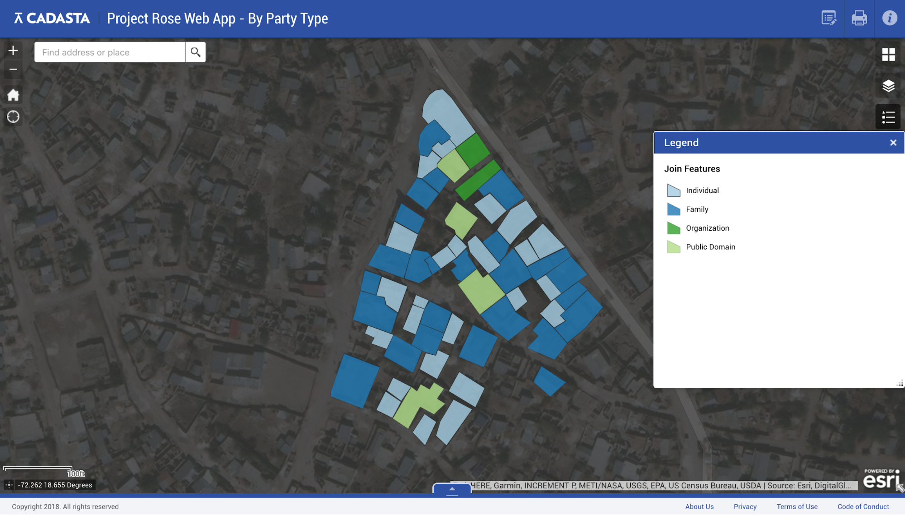
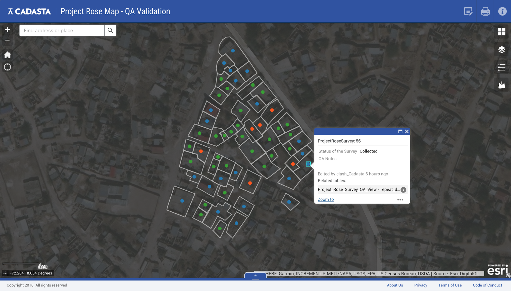

## Purpose

These steps will explain how to create a Web App in ArcGIS Online (AGOL).

## Requirements
1. You will need to have an account on the Cadasta AGOL platform.
2. You will need to create a web map with all of the relevant data layers (see [Creating an Online Map](create_webmap/index.md) for instructions on how to do this)

## Steps

1. Log into AGOL and find the web map you have prepared.
2. On the right side of the window, select **Create Web App** > **Using a Template**.
 
    
 
1. Select the **Cadasta Basic Template**.

    

1. Select **Create Web App**.

    
 
1. Complete the input for title, tags, summary, etc. and select Done.

    
 
1. Customize the editable parameters in the template. Select Save when complete.

    
 
1. Select **Launch** to view the completed Web App. Make adjustments by visiting the details page and selecting **Configure App**. For the demo projects, we are using [Project Rose Web App - All Data](https://cadasta.maps.arcgis.com/home/item.html?id=06fde68d4ec849949fc19220c831477b), [Project Rose Web App - By Party Type](https://cadasta.maps.arcgis.com/home/item.html?id=681bbcbd5d524112bfacc738ca211b47), [Project Rose Web App - QA Validation](https://cadasta.maps.arcgis.com/home/item.html?id=ce6bd05bcaab44799bb6621e39027039).

    
    
    

    *Note: If you want to create additional web apps for other audiences (to limit viewable data, etc.), you need to create an additional web maps and then repeat this step.* 

## Additional Resources for Using Web AppBuilder
[Web AppBuilder for ArcGIS](https://doc.arcgis.com/en/web-appbuilder/)

[Edit a Widget](https://doc.arcgis.com/en/web-appbuilder/create-apps/widget-edit.htm)
