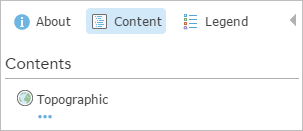
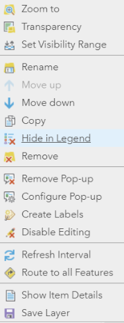
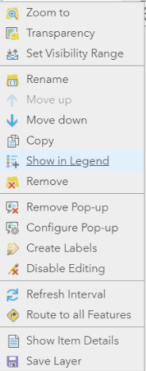
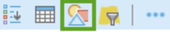

## Purpose

This page will explain how to create an online web map

## Requirements

1. You will need to have a username and passowrd set up for you by a Cadasta team member. If you do not have a user please contact support@cadasta.org
2. You will need to sign to your account - see [Introduction to your account](toc/intro_to_account/index.md) for a reminder.

## Tips

[Introduction to Item Types](https://faq.cadasta.org/intro_to_itemtypes/)

[Introduction to Map Viewer](https://faq.cadasta.org/intro_to_mapviewer/)

## Steps

## Add a Basemap

1. Navigate to ArcGIS Online (AGOL) and click Map at the top of the page.

2. At the top of the **Details** pane, click the **Content** button.

3. If necessary, click the **Basemap** button on the ribbon and choose a basemap.
4. Save your map. On the ribbon, click the **Save** button and choose **Save**.

**Add Layers**

1. On the ribbon, click the **Add** button and choose **Search for Layer**

   

   A default list of search results appears.

1. If necessary, click the dropdown arrow at the top of the pane and choose \_\_\_\_.
1. Type in the search box.
   You are able to limit the search results.
1. In the list of results, locate your search result.
1. Click **Add** to add the layer to the map.
   You can add as many layers as you would like.
1. At the top of the search pane, click the **Back** button.
   The layers are drawn, with their default symbols, in the order in which they were loaded into the map.
1. Save your map. On the ribbon, click the **Save** button and choose **Save**.

**Set Layer Properties**

1. In the **Contents** pane, point to your layer. Click the **More Options** button and choose **Rename**.
2. In the **Rename** window, change the layer name and click **OK**.
3. In the same way, rename each of your other layers.
4. In the **Contents** pane, point to one of your layers. Click the **More Options** button and click **Move up**.
   The layer moves up one position.
5. Move the **layer** to the top of the list.
6. In the **Contents** pane, point to the your layer. Click the **More Options** button and choose **Create Labels**.
7. Each entity is labeled.
8. In the **Label Features** pane, you can change the label size.
9. Open the properties for on of the layers and choose **Transparency**.
10. Set the transparency percentage.
11. Save your map. On the ribbon, click the **Save** button and choose **Save**.

**Define the Map Legend**

1. At the top of the **Contents** pane, click the **Legend** button.
   Legend entries are created for all layers except the basemap.
2. At the top of the **Legend** pane, click the **Content** button.
3. Open the properties for a layer and choose **Hide in Legend**.

   

4. Keep it hidden if you would like.
5. If you would like to show the layer, then choose **Show in Legend**.

   

6. View the legend again to see the effect, and then go back to the **Contents** pane.

**Change a Symbol**

1. In the **Contents** pane, point to a desired layer and click the **Change Style** button.

   

1. In the **Change Style** pane, the currently selected style is **Location (Single symbol)**, which is indicated by the check mark.

   In this style, all features in the layer are drawn with the same symbol. The Location style is appropriate when you want to see the features on the map but you're not interested in their particular characteristics, such as names or speed limits.

1. For a drawing style, under **Location (Single symbol)**, click **Options**.
1. Under **Showing Location Only**, click **Symbols** to change the symbol.
1. On the color palette, choose a color that you think will look good and click **OK**.
   The new color is applied to the map. (If you don't like it, click **Symbols** again to open the color palette and choose a different color.)
1. At the bottom of the **Change Style** pane, click **OK** and click **Done**.
1. Save your map. On the ribbon, click the **Save** button and choose **Save**.

---

**More Information**

**Esri Resource Links**

[Create a new map](https://learn.arcgis.com/en/projects/get-started-with-map-viewer/arcgis-online/lessons/create-a-map.htm#GUID-243D2F76-8824-4EE9-ABFA-CFC95E53F5A2)

[Add layers to the map](https://learn.arcgis.com/en/projects/get-started-with-map-viewer/arcgis-online/lessons/create-a-map.htm#ESRI_SECTION1_7BFB71101985470F8472E28B76965F91)

[Set layer properties](https://learn.arcgis.com/en/projects/get-started-with-map-viewer/arcgis-online/lessons/create-a-map.htm#ESRI_SECTION1_BF8BBF8CC15C46F79607E79E3435912D)

[Define the map legend](https://learn.arcgis.com/en/projects/get-started-with-map-viewer/arcgis-online/lessons/create-a-map.htm#ESRI_SECTION1_66FA27A452EA4F76A939E73CAAD94147)

[Change a symbol](https://learn.arcgis.com/en/projects/get-started-with-map-viewer/arcgis-online/lessons/create-a-map.htm#ESRI_SECTION1_A2B0061BEFEB4145B6D190B33D98EAE4)

**Notes**

1. If you're in a new session, clicking **Map** will open a new map. Otherwise, it will open an existing map (the last map you were using). If an existing map opens, click **New Map**, and choose **Create New Map**.
2. If you save the map, the map extent at the time of saving will become the extent used by the **Default extent** button. It can also be useful to add spatial bookmarks to navigate to particular map locations.
3. Layer properties are always accessed in the same way: by pointing to the layer name and clicking an appropriate button or clicking the **More Options** button and choosing the property you want to change.
4. The usual practice is to put points above lines, and lines above polygons. Points, lines, and polygons are all feature layers: they usually represent discrete geographic objects that have more or less precise locations and boundaries.
5. Tile layers are images and cannot be manipulated in the same ways as feature layers. They typically represent large, continuous surfaces rather than discrete objects. Tile layers cannot be moved above feature layers in a map.
6. When you start a new map, or open one of your own saved maps, it opens with the **Contents** pane showing. When anyone else opens a map created by you, however, it opens with the **Legend** pane showing.
7. A layer's default display settings, including its style and pop-up configuration, are made by its owner. Once you add a layer to your own map, however, you're free to change those settings.

---
