## Purpose

This page will explain how to delete a polygon collected in the field in ArcGIS Online

## Requirements

* You will need to have a username and password set up for you by a Cadasta team member. If you do not have a user please contact support@cadasta.org
* You will need to sign to your account - see [Introduction to your account](intro_to_account/index.md) for a reminder
* You will need to be a member of the group in which the feature has been shared.

-----

## Steps

1.	Navigate to your User Group
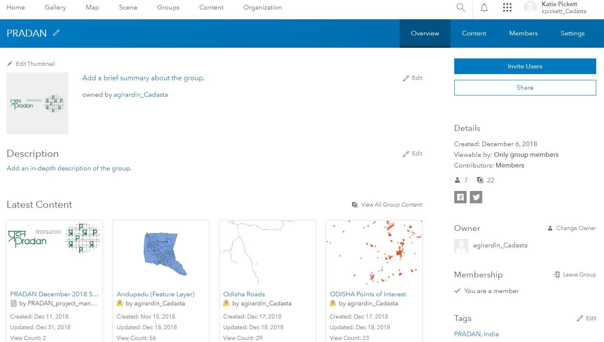

2.	Find the Field Collector Map (Web Map) you used to collect the polygons

1. Select the Web Map

    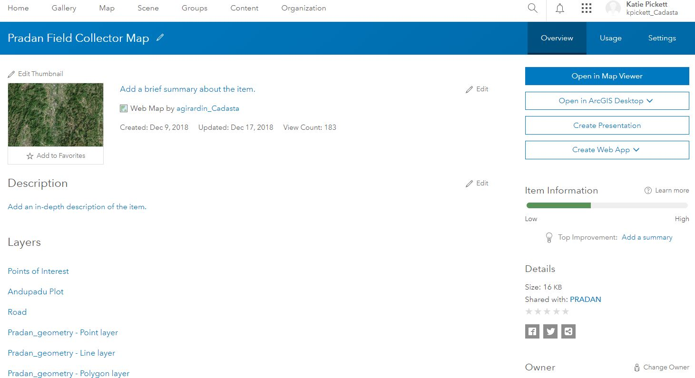

1. Press the **Open in Map Viewer** button

1. See the Map Viewer Overview

    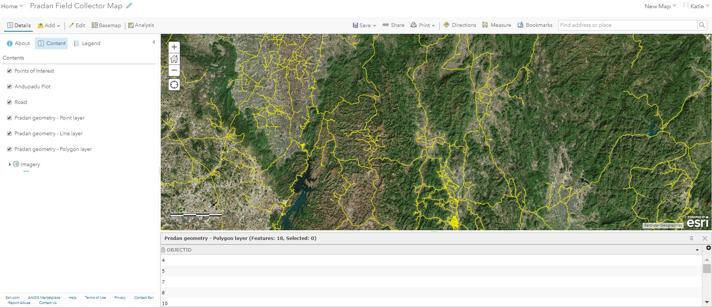

1. Select **Content**

1. See the **Map Viewer Content** Sidebar
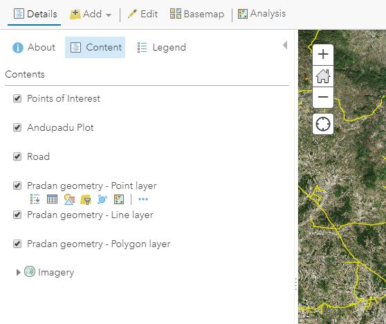

1. Hover the mouse over the polygon layer

    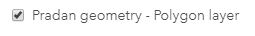

1. You will see multiple options. Select **Show Table**

   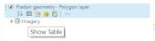

2. See Show Table view

    

3. Click **More Options** within the table sub-window
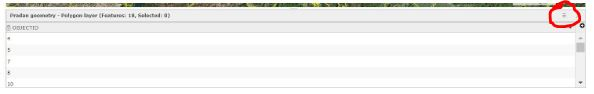

1. Select Show/Hide Columns

    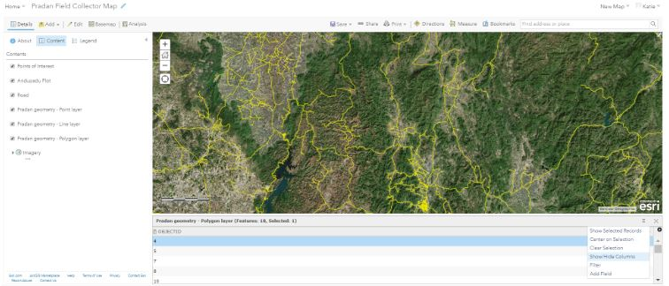
    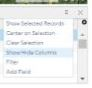
1. You can toggle columns on and off by checking and unchecking the boxes next to the
column names

    <small> Note: In this example, only the OBJECTID column is toggled on and showing</small>

    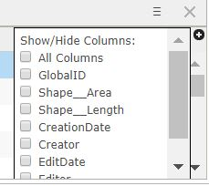
    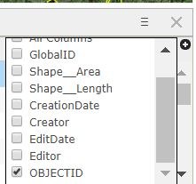

    See when additional columns are toggled on
    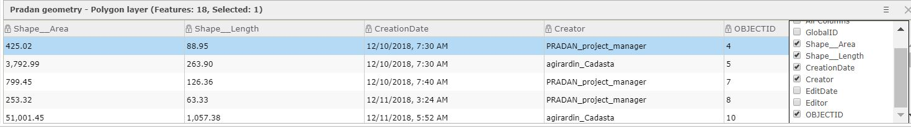

12.	Click **More Options**

1. Select **Center on Selection**

    <small>Note: The Selected Record in this example is OBJECTID 4</small>

    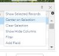

14.	See OBJECTID 4 Selection in Map Viewer
    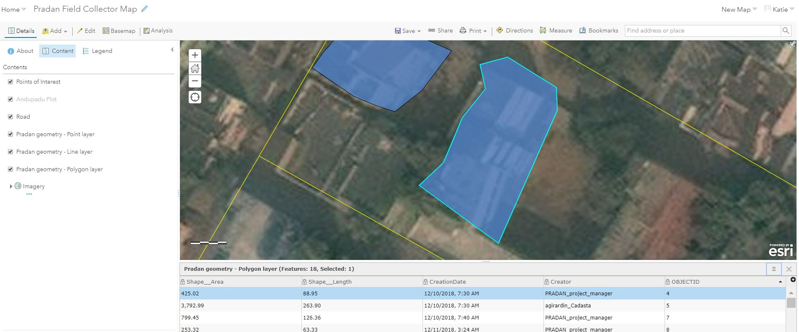

15.	Click on the selected polygon record to see the associated pop-up

    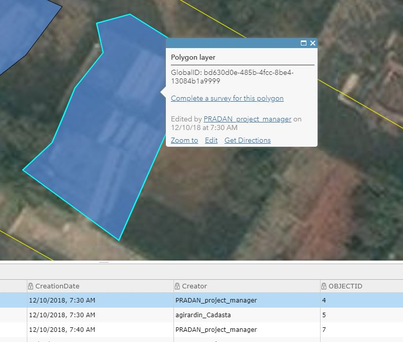

1. Select **Edit** in the pop-up to edit the polygon

1. See the Edit pop-up window

    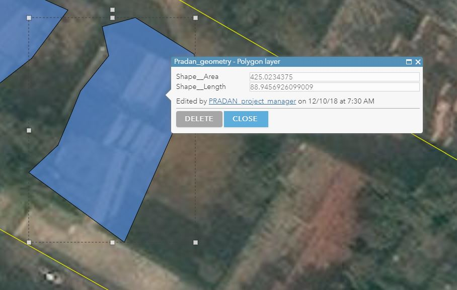

1. Press **Delete** to delete the selected polygon feature
1. Press **Close** to stop editing

