## Purpose

These steps will explain how to delete a collected survey record in the Survey123 website.

## Requirements
You will need to have an account on the Cadasta AGOL platform and be the owner of the survey.

## Steps

1.	Navigate to [My Surveys](http://www.survey123.arcgis.com/)

    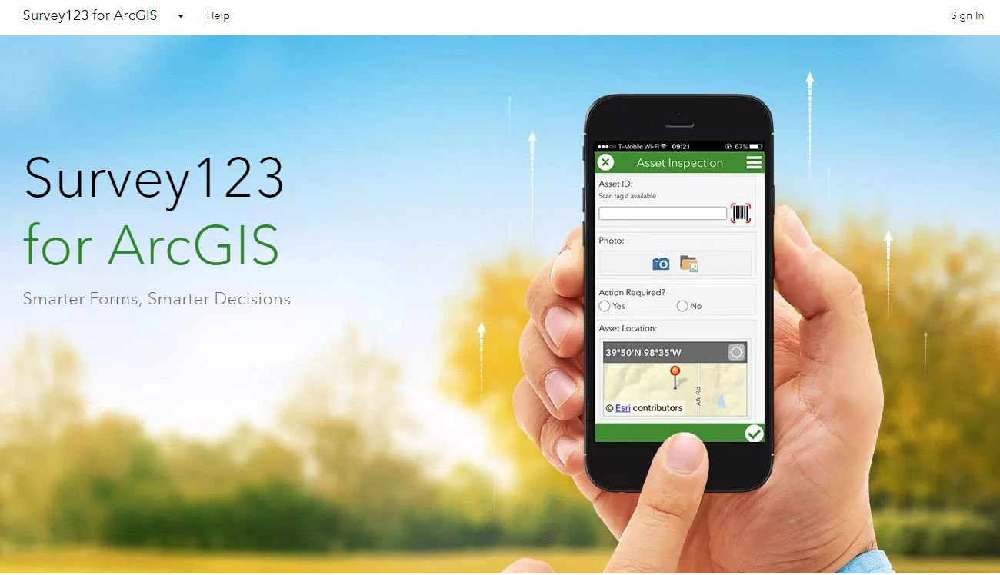
	
2. Sign in to your account

    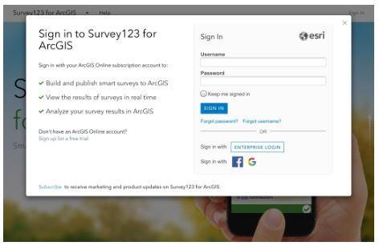
 
3. If not automatically, navigate to **All Surveys**

    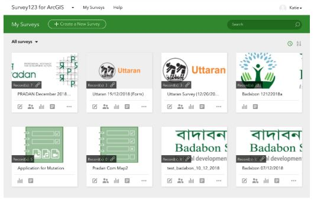

    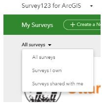

4. Select your desired survey
 
    *Note: The number of uploaded surveys is reflected in the Record(s) information shown on the survey’s thumbnail. In this case, there are seven records.*
 
    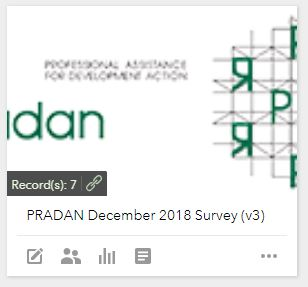
 
5. You will automatically be brought to the **Overview Page** of your survey

    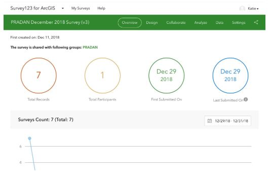

6. Navigate to the **Data Page** of your survey

    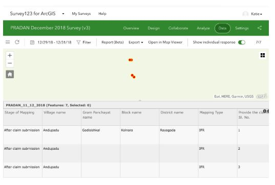

7. Select **Open in Map Viewer** on the Data Page of your survey

    *Note: A pop-out (inset) window will appear of the mapped view of collected survey records.*

    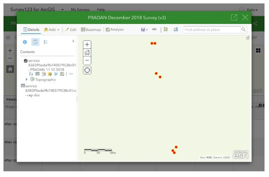
 
8.  Click on the record you would like to delete
 
    *Note: The selected record’s data will be shown in a pop-up box which can be scrolled through.*

    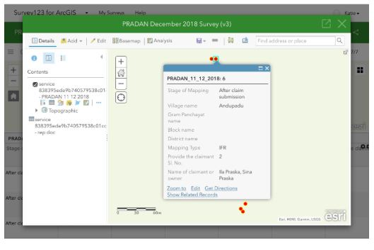

9.  Scroll down through the record pop-up and select Edit

    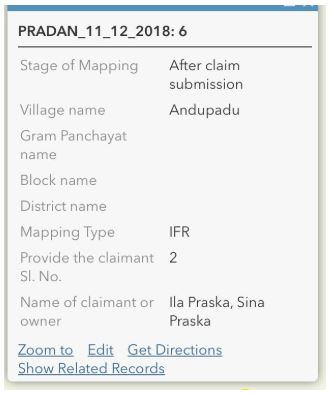

10. The Edit survey screen will open
 
    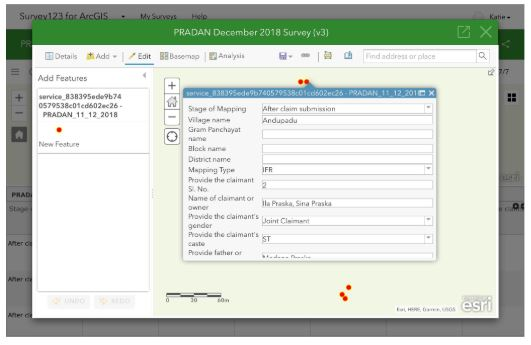

11. Scroll down through the Edit screen and select Delete at the bottom
  
    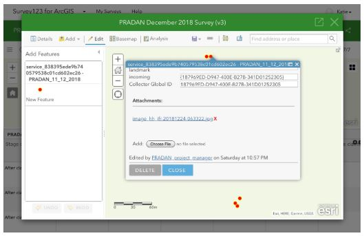

