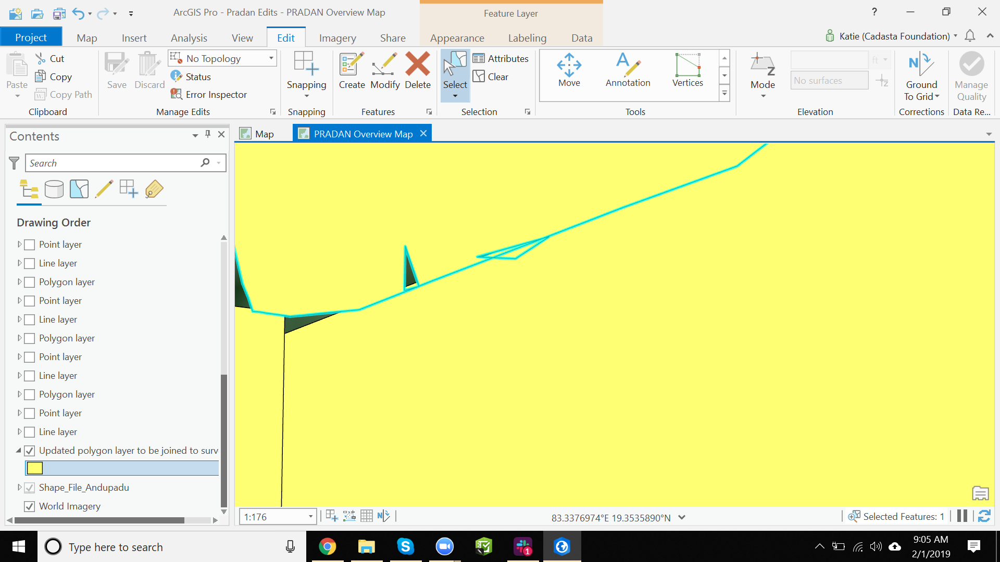
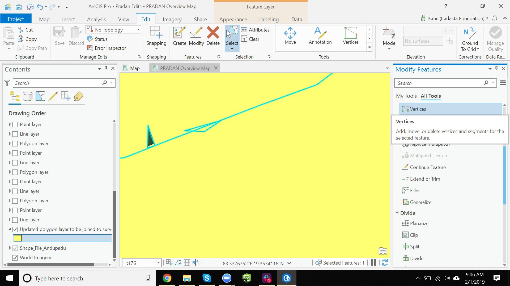
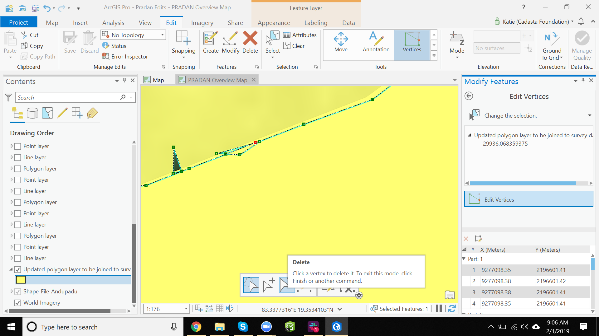
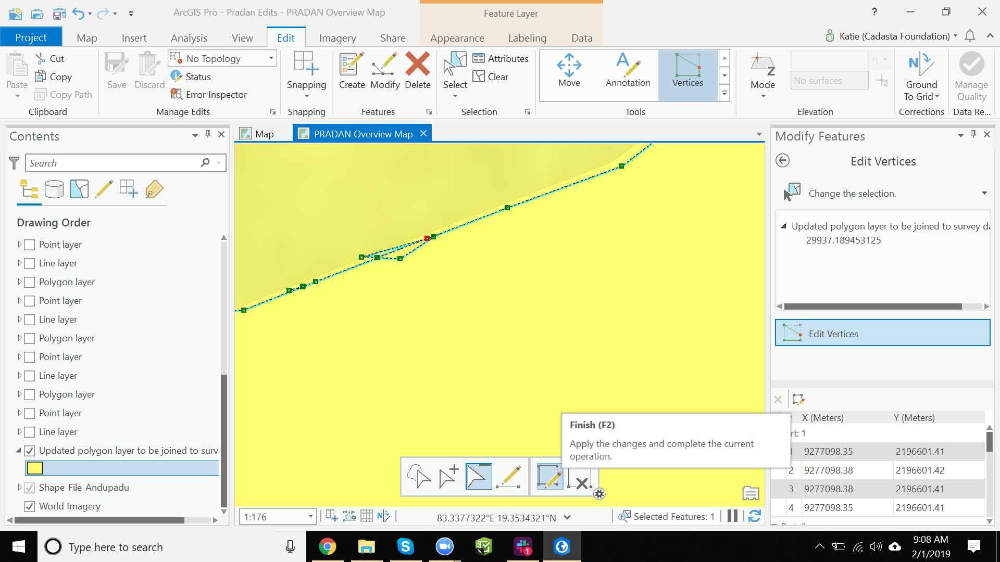

## Purpose

This page will explain how to delete vertices of your polygon in ArcGIS Pro

## Requirements

* You will need to have a username and password set up for you by a Cadasta team member. If you do not have a user please contact support@cadasta.org
* You will need to sign to your account - see [Introduction to your account](intro_to_account/index.md) for a reminder
* You will need to have an Esri license for ArcGIS Pro and have it installed on your workstation
* You will need to be a member of the group in which the feature has been shared.

-----

## Steps

1. Open ArcGIS Pro and open the project in which you have the polygons you want to edit
2. In the "Map" tab, press the "Select" button and then select the polygon you wish to edit
   
3. Select the "Edit" tab

1. In the "Edit" tab, press the "Modify" button

1. In the "Edit" tab -> "Tools" section, press the "Vertices" button

1. Press the "Delete" button and the select the vertices in the map that you want to delete

1. Press the "Finish" button
