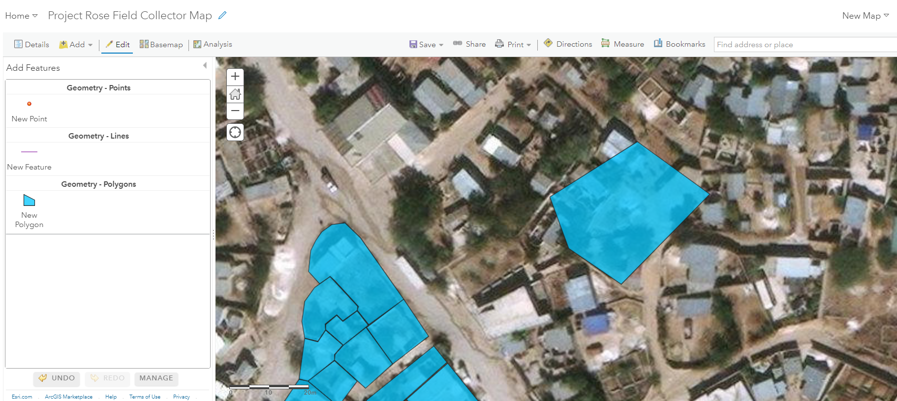
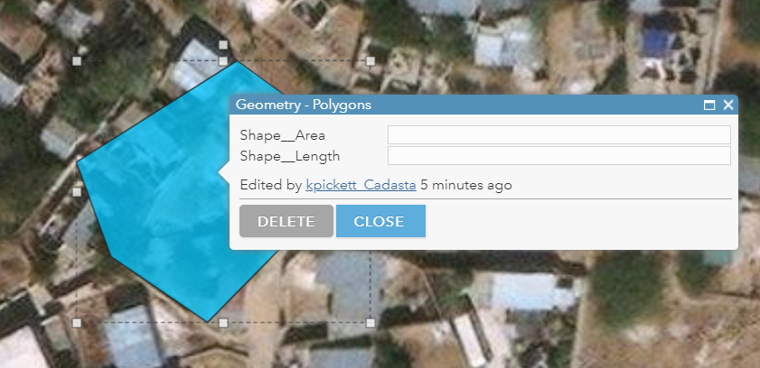
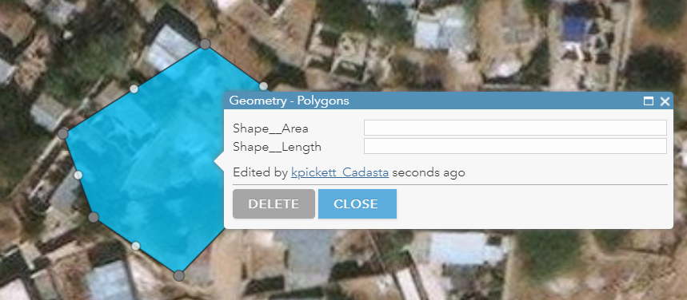
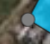
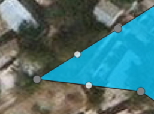
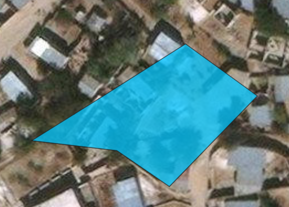

<u>**Purpose**</u>

This page will explain how to edit the vertices in a polygon  in ArcGIS Online

<u>**Requirements**</u>

* You will need to have a username and password set up for you by a Cadasta team member. If you do not have a user please contact support@cadasta.org
* You will need to sign to your account - see [Introduction to your account](intro_to_account/index.md) for a reminder
* You will need to be a member of the group in which the feature has been shared.
-----

<u>**Steps**</u>

1.	Navigate to **map** in Map Viewer

2.	Navigate to your desired **polygon**

    

3.	Click the **polygon** once

    

4.	**Pause** for 5 seconds

5.	Click the **polygon again**

    

6.	Move the **vertex**

    
    

7.	Click anywhere **outside** of the polygon
    
    

8.	Click **Save**

    

