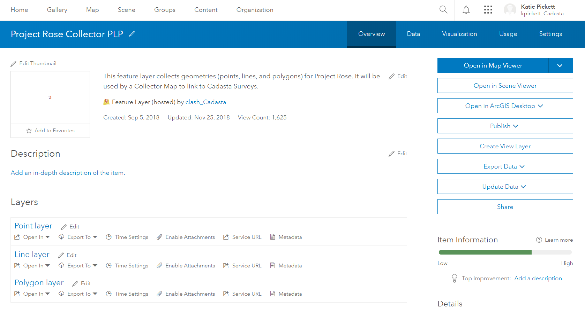
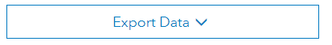
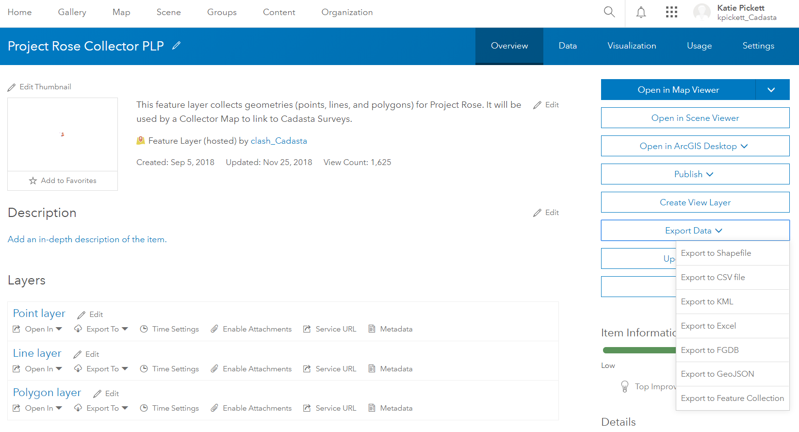
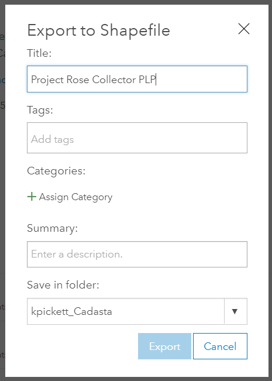
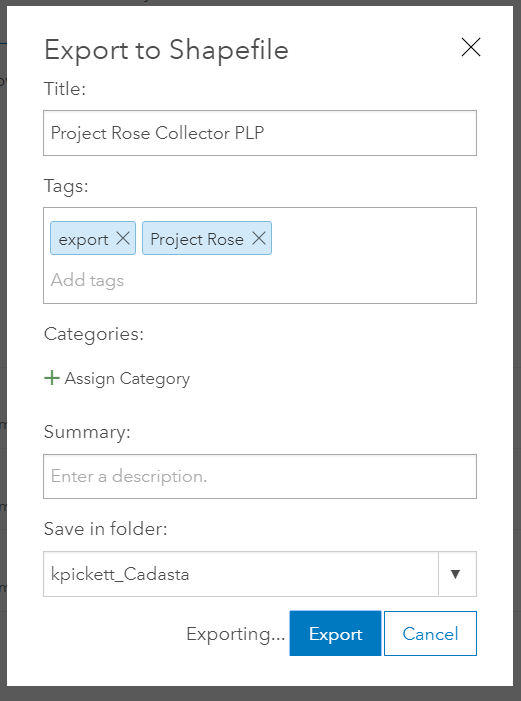
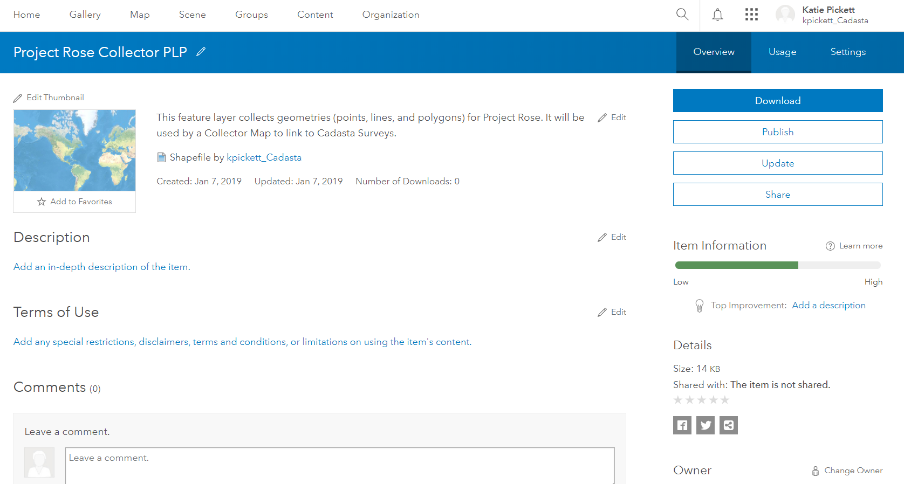
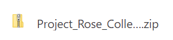

### Purpose

This page will explain how to export a feature layer in ArcGIS Online

### Requirements

* You will need to have a username and password set up for you by a Cadasta team member. If you do not have a user please contact support@cadasta.org
* You will need to sign to your account - see [Introduction to your account](intro_to_account/index.md) for a reminder
* You will need to be the owner of the feature layer and it needs to be marked as "Allow others to export to different format". For further assitannce please contact support@cadasta.org

-----

### Steps

1.	Navigate to the desired Feature Layer

    

2.	Click **Export Data**

    

3.	Click **Export to Shapefile**


4.	See **Export to Shapefile** window

    

5.	Type in a **Title**, one or more **Tags**, and choose a **Folder**

    <small>Note: The folder is on ArcGIS Online and not on your computer or device</small>

1. Click **Export**
7.	See the resulting exported file page

8.	Click **Download**

    

9.	The file will download as a zipped file

    

