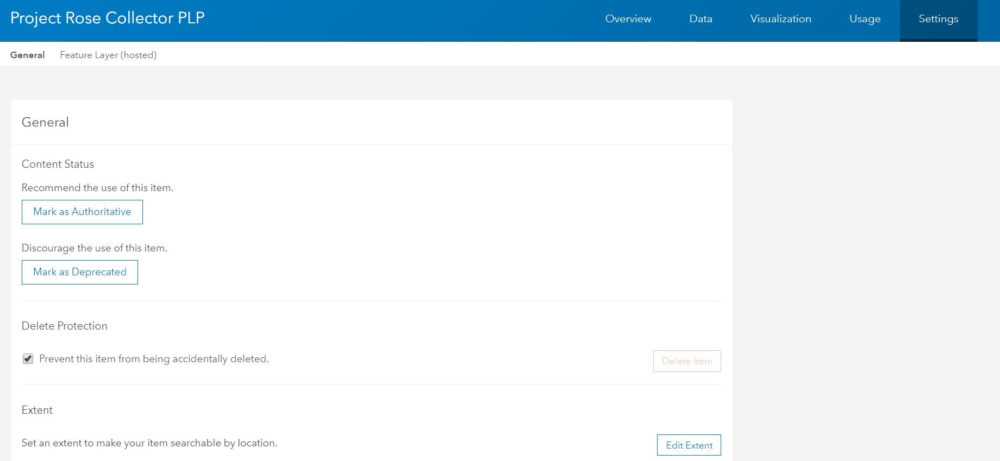
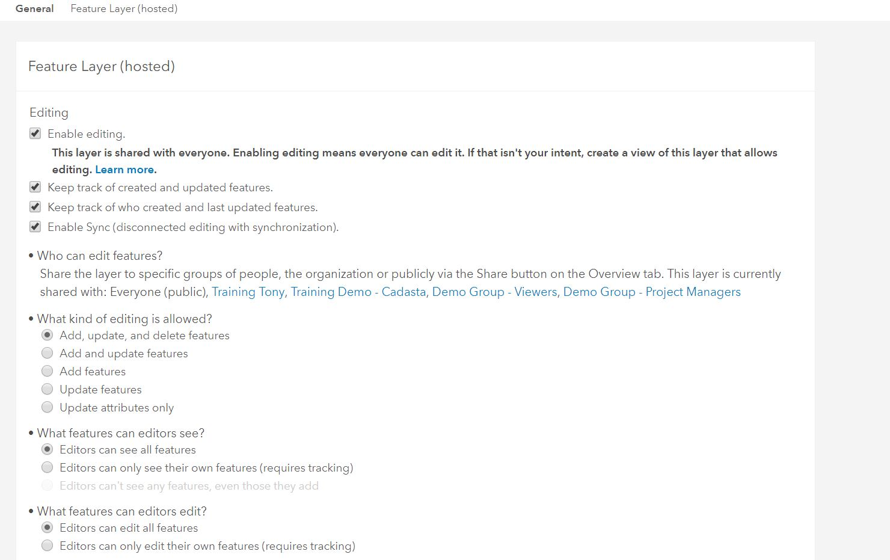
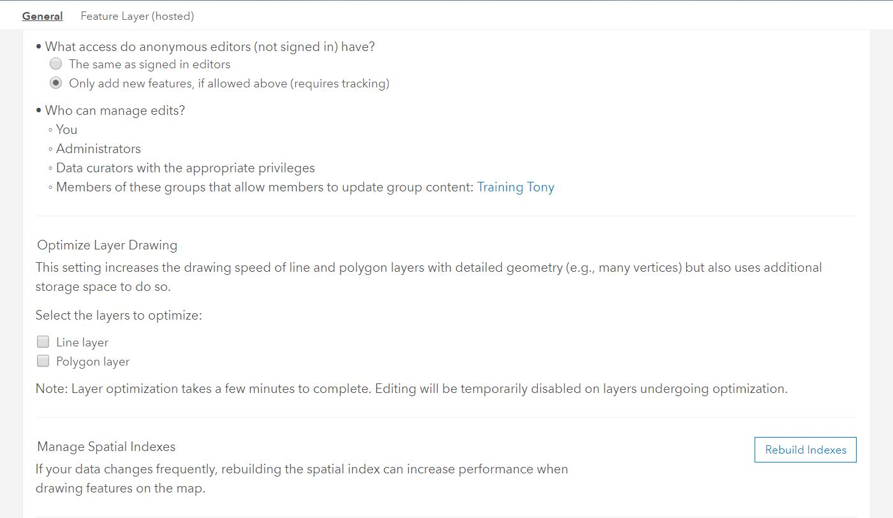

## Purpose

This page will explain how to export a feature layer in ArcGIS Online

## Requirements

* You will need to have a username and password set up for you by a Cadasta team member. If you do not have a user please contact support@cadasta.org
* You will need to sign to your account - see [Introduction to your account](intro_to_account/index.md) for a reminder
* You will need to be the owner of the feature layer. For further assistance please contact support@cadasta.org

-----

## Steps

1.	Navigate to the desired Feature Layer

    Go to the **Settings** tab and make sure the settings are the same as below:

    
    
    
    

1. Go to the **Settings** tab
    

    Review the following screenshots and make sure the settings are the same:

    
    
    

    If you have made any changes press the **Save** button

2.	Click **Export Data**

    

3.	Click **Export to Shapefile**


4.	See **Export to Shapefile** window

    

5.	Type in a **Title**, one or more **Tags**, and choose a **Folder**

    <small>Note: The folder is on ArcGIS Online and not on your computer or device</small>

1. Click **Export**
7.	See the resulting exported file page

8.	Click **Download**

    

9.	The file will download as a zipped file

    

