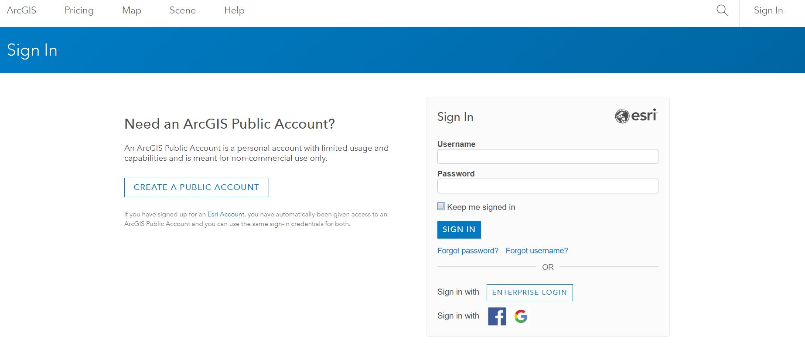
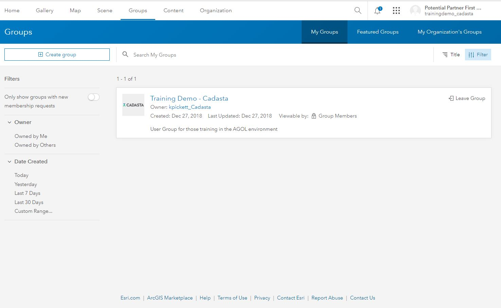
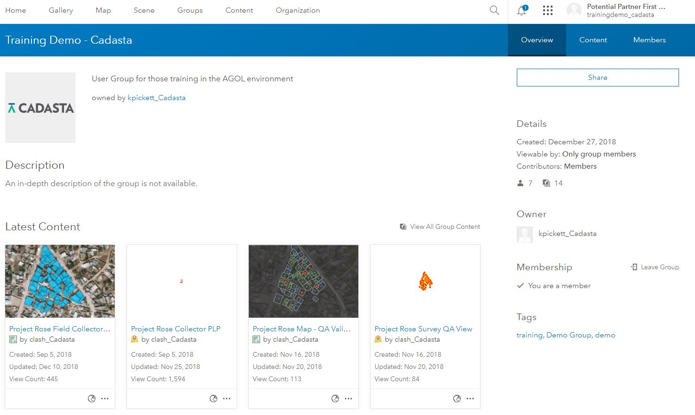
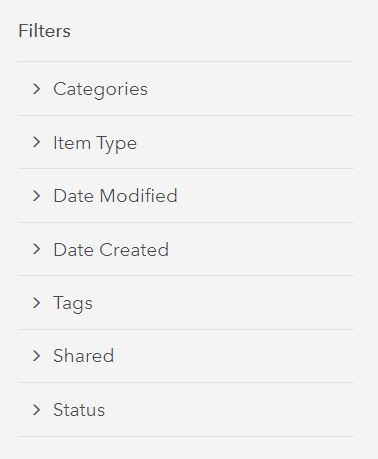
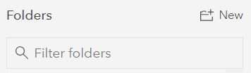
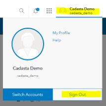

### Purpose

This page will explain how to log in to your ArcGIS Online account and view contents

### Requirements

* You will need to have a username and passowrd set up for you by a Cadasta team member. If you do not have a user please contact support@cadasta.org

---

### Steps

1. Browse to https://www.arcgis.com/home/signin.html
2. Sign-in with username and password at the url

    

3. Your home page will be the User Group page. Select the group name

    

4. Content will be found within the group

    

5. Content can be filtered in various ways

    
    

6. Sign-out of your account by selecting your User Account name in the top-left of your screen

    

