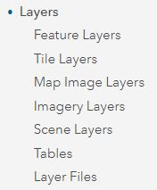

🔼Remember: “**Introduction to Your Account**”

User Account Information

<table>
    <tr>
    <td>Login page</td>
    <td>https://www.arcgis.com/home/signin.html</td> 
  </tr></table>

1. **Sign In** with username and password at the url

2. Your home page will be the **User Group** page
	Select **Training Demo - Cadasta**

3. **Content** will be found within the group

4. Content can be **filtered** in various ways

5. **Sign Out** of your account by selecting your **User Account** name in the top-left of your screen

----


1. 	Navigate to **Content** 
	
    
    

2. 	See **Item Types** in the Sidebar

    

3. 	Select item type **Maps**

	Note: 	There are two sub-item types (1) Web Maps and (2) Map Files

    

4. 	Select item sub-type **Web Maps**

	Note: 	There are no Map Files sub-type in the demo group and are not covered in this 
documentation.

    

5. 	Select **Web Map** Project Rose Field Collector Map

    

6. 	Click **Open in Map Viewer**

    

7. 	Navigate back to User Group Content and Select **Web Map** Project Rose Map - Access 
to Electricity

    

8. 	Click **Open in Map Viewer**

    

9. 	Navigate to **Content** 
	
	
    

10. See **Item Type**s in the Sidebar

    

11. Select item type **Layers**

	Note: 	There are seven sub-item types (1) Feature Layers, (2) Tile Layers, (3) Map 
Imager Layers, (4) Imagery Layers, (5) Scene Layers, (6) Tables, and (7) Layer 
Files

    

1.  Select item sub-type **Feature Layers**

	Note: 	This documentation only covers Feature Layers.
 
    

13. Select **Feature Layer** Project Rose Field Collector PLPd

    

14. Click **Open in Map Viewer**

    

15. Navigate back to User Group Content and Select **Feature Layer** Project Rose QA 
      	View
	
    

16.	 Click **Open in Map Viewer**

        

17. Navigate back to User Group Content and Select **Feature Layer** Project Rose Survey

    

18. Click **Open in Map Viewer**

    

19. Navigate to **Content** 
	
    
    

20. See **Item Types** in the Sidebar

    

21. Select item type **Apps**

	Note: 	There are three sub-item types (1) Web Apps, (2) Mobile Apps, and (3) Desktop 
Apps

    

22. Select item sub-type **Web Apps**

	Note:	There are no Mobile App or Desktop App sub-types in the demo group and are 
not covered in this documentation.	

    

23. Select **Web App** Project Rose Dashboard - Overview

    

24. Click **View Dashboard**	
	
    

25. See **Dashboard Details** by selecting a collected record’s __**polygon**__

    

26. Navigate back to **Content** and Select **Web App** Project Rose Dashboard - QA 
Dashboard

    

27. Click **View Dashboard**	

    

28. See **Dashboard Details** by selecting a collected record’s __**point**__

    

29. Navigate back to **Content** and Select Web App Project Rose Dashboard - Resource 
     	Metrics

    

27. Click **View Dashboard**	

    

28. See **Dashboard Details** by selecting a collected record’s __**polygon(s)**__

	Note: This **dashboard** has the possibility of one or more manual selections at one time.

    

Other Item Types not covered in this documentation are:

**Scenes**

**Tools**

**Files**

