### Purpose

This page will explain use the map viewer in ArcGIS Online

### Requirements

- You will need to have a username and password set up for you by a Cadasta team member. If you do not have a user please contact support@cadasta.org
- You will need to sign to your account - see [Introduction to your account](intro_to_account/index.md) for a reminder.

### Tips

[Introduction to Item Types](intro_to_itemtypes/index.md)

---

### Steps

1. Navigate to the Map Viewer by clicking **Map** from the top bar

   

   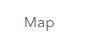

    You can navigate to the Map Viewer from any Feature Layer item details page by clicking **Open in Map Viewer**

    

2.  See the My Map page overview

    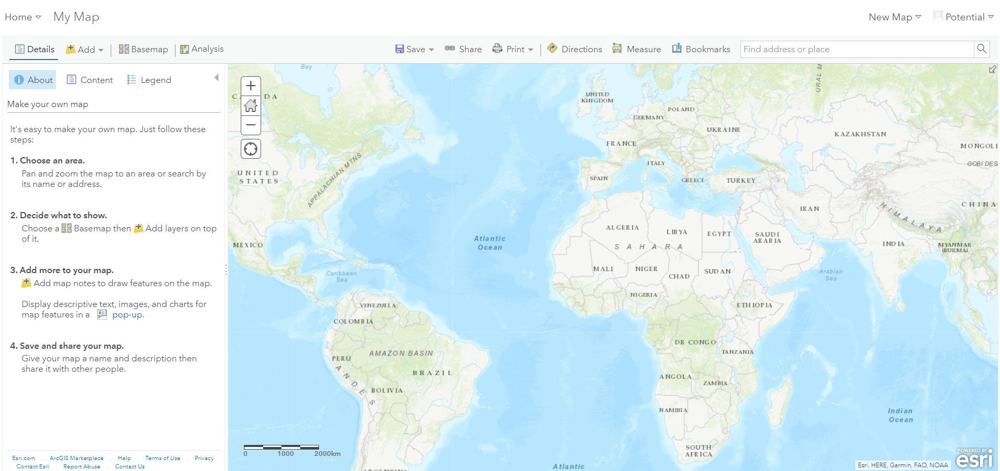

3.  The **Home** button allows you to navigate back to the main ArcGIS Online (AGOL) navigation options

    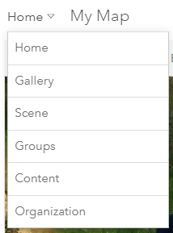

4.  Select **Details** to navigate to **About**, **Content**, and **Legend** sections.

    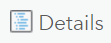

5.  Select **Content** to view layers (and **Layer Options**)

    
    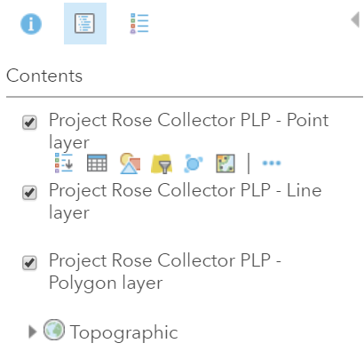

6.  Select the **Layer Options** to access **Show Legend**, **Show Table**, **Change Style**,
    **Filter**, **Perform Analysis**, and **More Options**

            

7.  Select the **Legend** to view layers in their symbolized form

    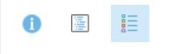
    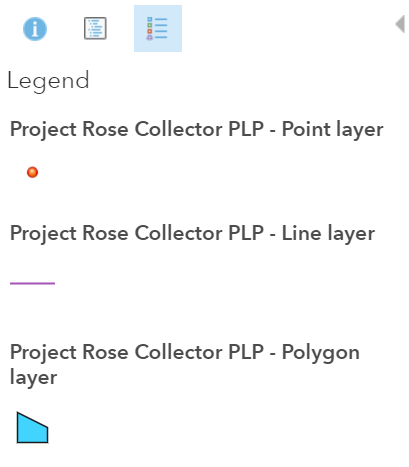

.Select **Add** to add layers to a map

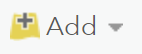

1. There are multiple options for adding data layers to the map: **Search for Layers**, **Browse Living Atlas Layers**, **Add Layer from Web**, **Add Layer from File**, and **Add Map Notes**

   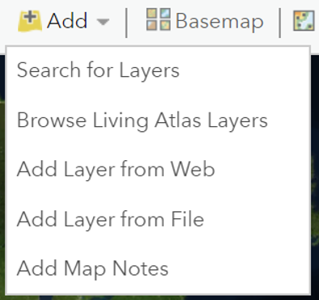

1. Select **Basemap** to choose a basemap

   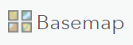
   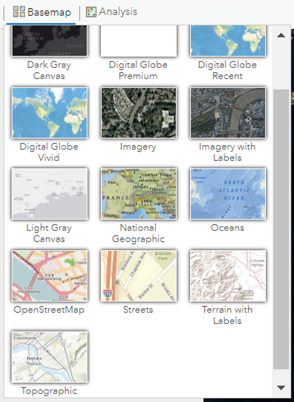

1. Navigate to Zoom In, Zoom Out, and Home location by using the **Navigation Console**

   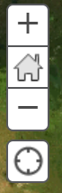

1. Save your map by selecting **Save**

   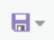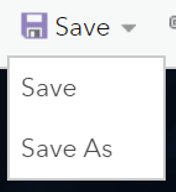

1. Share your map by selecting **Share**

   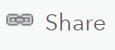

---

**More Information**

Esri Resource Links

[Explore a Map](https://learn.arcgis.com/en/projects/get-started-with-map-viewer/arcgis-online/lessons/explore-a-map.htm)
