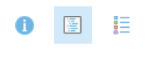

:arrow_up_small: Remember: “**How To: Introduction to Your Account**”

User Account Information

<table>
    <tr>
    <td>Login page</td>
    <td>https://www.arcgis.com/home/signin.html</td>
  </tr></table>

1. **Sign In** with username and password at the url

2. Your home page will be the **User Group** page
   Select **Training Demo - Cadasta**

3. **Content** will be found within the group

4. Content can be **filtered** in various ways

5. **Sign Out** of your account by selecting your **User Account** name in the top-left of your screen

---

:arrow_up_small: Remember: “**How To: Introduction to Item Type**s”

1.  Navigate to **Content**

2.  See **Item Types** in the Sidebar

3.  Select item type **Maps**

    _Note:_ There are two sub-item types (1) Web Maps and (2) Map Files

4.  Select item sub-type **Web Maps**

    _Note:_ There are no Map Files sub-type in the demo group and are not covered in this

    documentation.

5.  Select **Web Map** Project Rose Field Collector Map

6.  Click **Open in Map Viewer**

7.  Navigate back to User Group Content and Select **Web Map** Project Rose Map - Access to
    Electricity

8.  Click **Open in Map Viewer**

9.  Navigate to **Content**

10. See **Item Types** in the Sidebar

11. Select item type **Layers**

    _Note:_ There are seven sub-item types (1) Feature Layers, (2) Tile Layers, (3) Map

    Imager Layers, (4) Imagery Layers, (5) Scene Layers, (6) Tables, and (7) Layer
    Files

12. Select item sub-type **Feature Layers**

    _Note:_ This documentation only covers **Feature Layers**.

13. Select **Feature Layer** Project Rose Field Collector PLP

14. Click **Open in Map Viewer**

15. Navigate back to User Group Content and Select Feature Layer Project Rose QA
    View

16. Click **Open in Map Viewer**

17. Navigate back to User Group Content and Select **Feature Layer** Project Rose Survey

18. Click **Open in Map Viewer**

19. Navigate to **Content**

20. See **Item Types** in the Sidebar

21. Select item type **Apps**

    _Note:_ There are three sub-item types (1) Web Apps, (2) Mobile Apps, and (3) Desktop Apps

22. Select item sub-type **Web Apps**

    Note: here are no Mobile App or Desktop App sub-types in the demo group and are not covered in this documentation.

23. Select **Web App** Project Rose Dashboard - Overview

24. Click **View Dashboard**

25. See **Dashboard Details** by selecting a collected record’s **polygon**

26. Navigate back to Content and Select **Web App** Project Rose Dashboard - QA Dashboard

27. Click **View Dashboard**

28. See **Dashboard Details** by selecting a collected record’s **point**

29. Navigate back to **Content** and Select **Web App** Project Rose Dashboard - Resource Metrics

30. Click **View Dashboard**

31. See **Dashboard Details** by selecting a collected record’s **polygon(s)**

    _Note:_ This **dashboard** has the possibility of one or more manual selections at one time.

Other Item Types not covered in this documentation are:

Scenes

Tools

Files

---

1. Navigate to the Map Viewer by clicking **Map** from the top bar

   

   

    You can navigate to the Map Viewer from any Feature Layer item details page by clicking **Open in Map Viewer**

    

1.  See the My Map page overview

    

1.  The **Home** button allows you to navigate back to the main ArcGIS Online (AGOL) navigation options

    

1.  Select **Details** to navigate to **About**, **Content**, and **Legend** sections.

    

1.  Select **Content** to view layers (and **Layer Options**)

    
    

1.  Select the **Layer Options** to access **Show Legend**, **Show Table**, **Change Style**,
    **Filter**, **Perform Analysis**, and **More Options**

        

1.  Select the **Legend** to view layers in their symbolized form

    
    

.Select **Add** to add layers to a map

1. There are multiple options for adding data layers to the map: **Search for Layers**, **Browse Living Atlas Layers**, **Add Layer from Web**, **Add Layer from File**, and **Add Map Notes**

   

1. Select **Basemap** to choose a basemap

   
   

1. Navigate to Zoom In, Zoom Out, and Home location by using the **Navigation Console**

   

1. Save your map by selecting **Save**

   

1. Share your map by selecting **Share**

   

---

**More Information**

Esri Resource Links

[Explore a Map](https://learn.arcgis.com/en/projects/get-started-with-map-viewer/arcgis-online/lessons/explore-a-map.htm)
