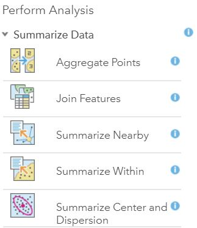

Before joining features, please make sure the following has been done:

1. You are the owner of feature layer 1
1. You are the owner of feature layer 2
1. You know which AGOL folder you can access

---

1. Navigate to the desired Web Map and press the "*Item Details*" button

2. Press the **Open in Map Viewer** button 
3. See the **Web Map** 

4. Click **Analysis **

5. See **Perform Analysis** sidebar

6. Click **Summarize Data** 
   
1. See **Summarize Data** 

1. Click **Join Features** 

1. See the **Join Features Steps**

1. Choose your **target layer** (layer 1 mentioned in the pre-steps)

    <small>Note: This will be your geometry layer in this example </small>

1. Choose your **join layer** (layer 2 mentioned in the pre-steps)
	
    <small>Note: This will be your survey layer in this example</small>

1. Select the J**oin Type, Choose the fields to match**
	
    <small>Note: This example bases the join on fields (tables) and not on geometry (spatial) </small>
    
1. Select the fields to join
    

    1. Select **GlobalID** (layer 1) 
    2. Select **collectorID** (layer 2)
   

1. Choose **Join Operation, Join one to many**
	
    <small>Note: This example uses a one to many relationship but you could use a one to one relationship for other reasons </small>

1. **Name** the join and select the **folder** to save the join in (remember the folder from the pre-steps)

1. **Uncheck** the "Use current map extent" checkbox and check the "**Create results as hosted feature layer view**"

1. Click **Run Analysis**

1. See your newly created Feature Layer in the **Contents sidebar** of the Web Map with the other Feature Layers