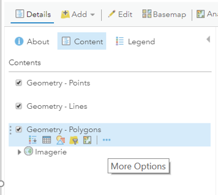
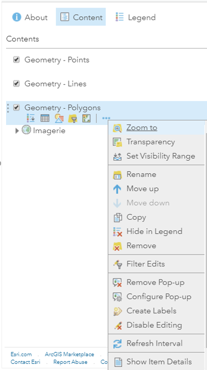
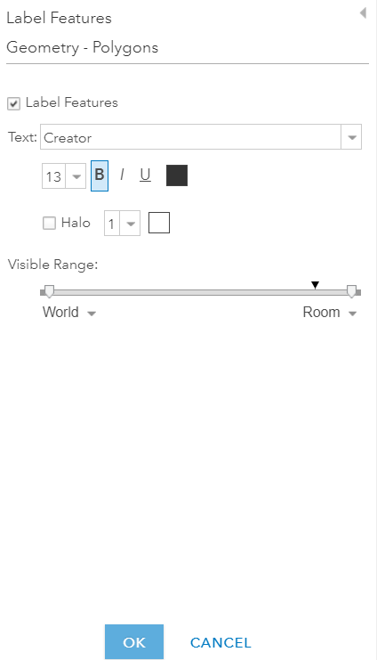
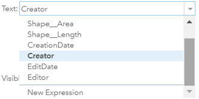
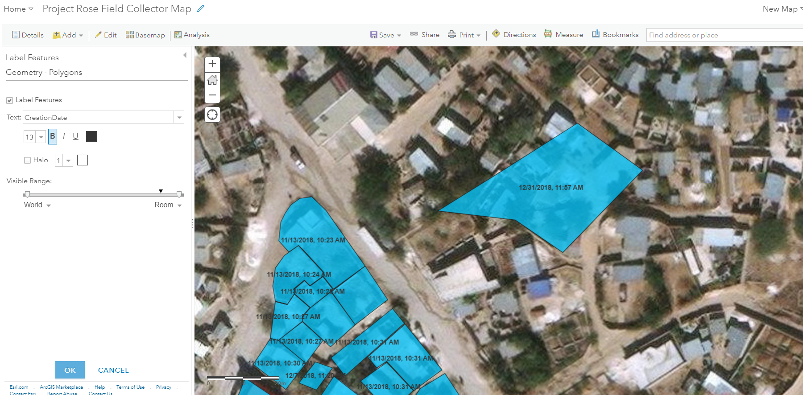
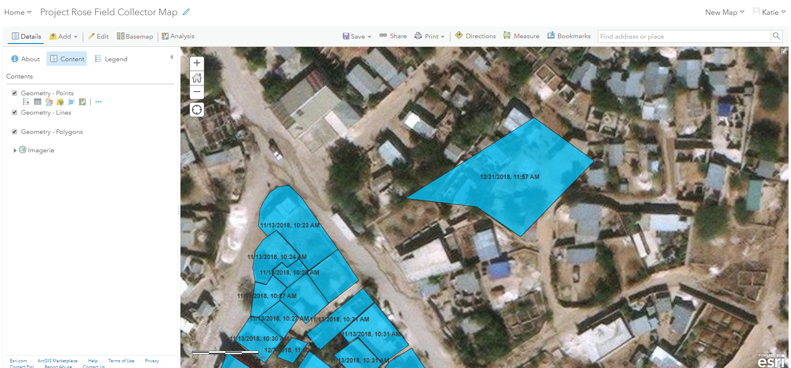

1.	Navigate to **map** in Map Viewer

2.	Select **More Options**  from the desired layer

3.	Select **Create Labels** from **More Options**

4.	See the **Label Features** window

    

5.	Choose desired label from the **Text** drop-down

    <small>Note: The drop-down options consist of attributes. A new expression can be created and applied. The expression must be written using Arcade expression language. You can read more about Arcade expressions at this link.</small>

    

6.	In this example, the **CreationDate** attribute was chosen in the **Text** drop-down

    

7.	Press **OK** once the labels are set

8.	Click **Save**

    

9.	See the end result of the labelled polygons

    
