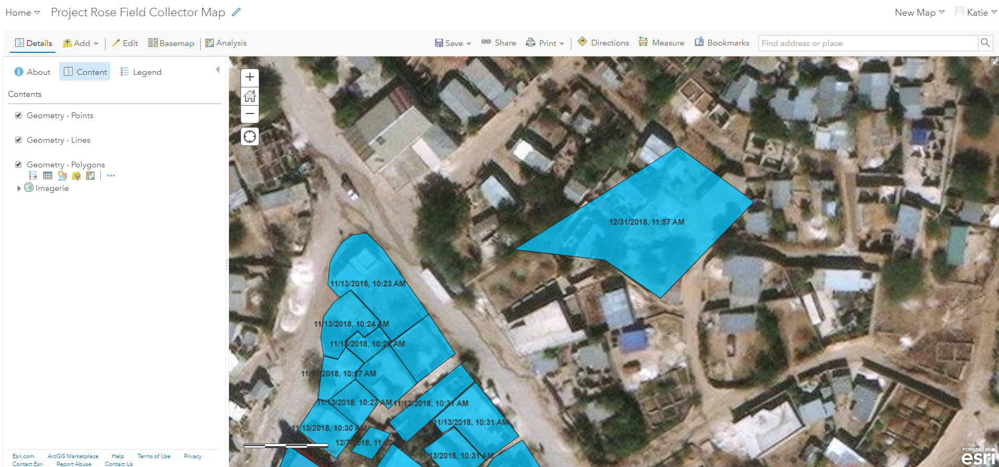
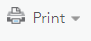
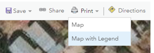
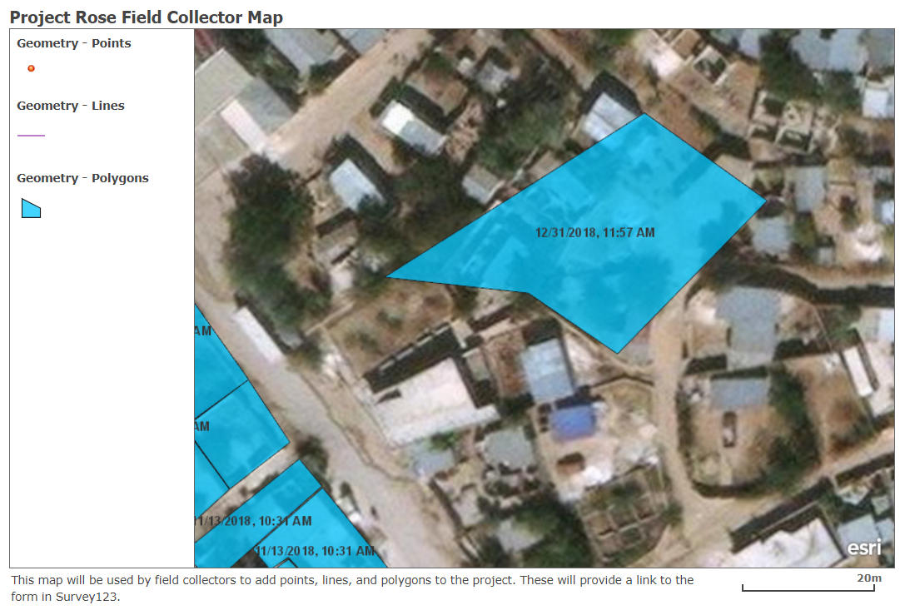

<u>**Purpose**</u>

This page will explain how to print a web map in ArcGIS Online

<u>**Requirements**</u>

* You will need to have a username and password set up for you by a Cadasta team member. If you do not have a user please contact support@cadasta.org
* You will need to sign to your account - see [Introduction to your account](intro_to_account/index.md) for a reminder
* You will need to have a printer defined on your workstation

-----

<u>**Steps**</u>

1.	Navigate to your desired **map** in **Map Viewer**

2.	Select **Print**

    

3.	Select **Map with Legend**

    

4.	See the **output screen**

    

5.	Choose **Print** from your web browser
