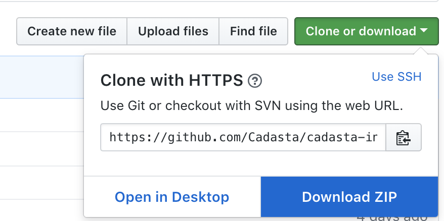

# Example Question 2

This question's file is in it's own directory! This makes it easy to colocate it's dependencies, such as images.

## Setup

Once installed, you will need to import this book's Git repository.

1. Download the GitHub repository to your local machine.

   1. Navigate to the repository URL: [https://github.com/Cadasta/cadasta-internal-docs](https://github.com/Cadasta/cadasta-internal-docs)
   2. Download the repository as a ZIP file.

      
