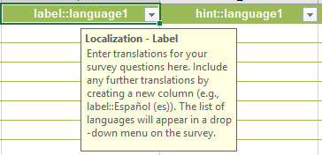
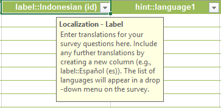

1. Open your survey form in Microsoft Excel and navigate to the "Survey" tab 
2. Scroll over to the second Label column, or field, header
   
    

    If you do not know the official language or subtag to use, please search for the language from this link: https://www.iana.org/assignments/language-subtag-registry/language-subtag-registry

3. The second language field header should follow this pattern

    label::Description (subtag)

    For example, for the Indonesian language the syntax would be

    label::Indonesian (id)

4. Note that the description name upholds proper capitalization, or proper casing, while the subtag is completely uncapitalized 

    Also please note that there is only a space between the description and the open parenthesize

    Here is how the final result would look like:

   

