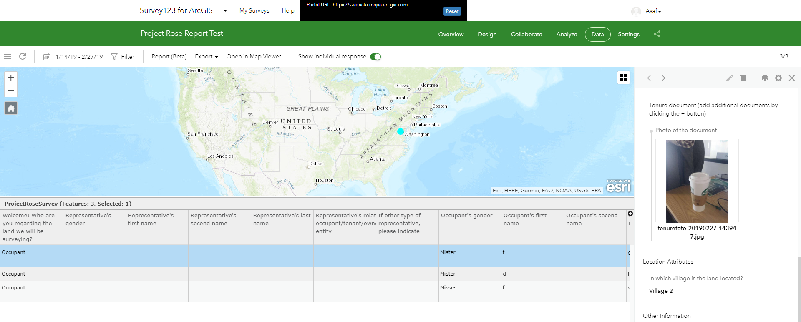
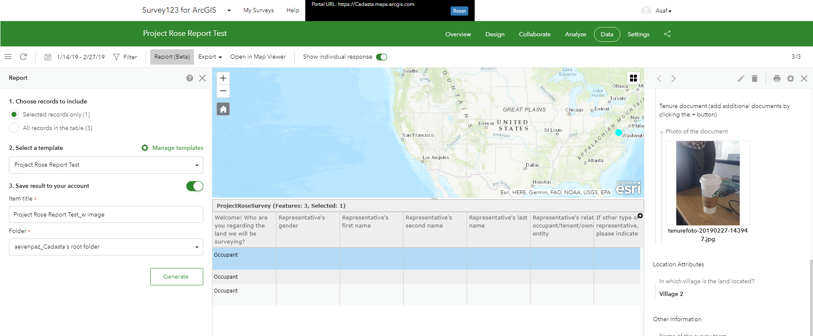
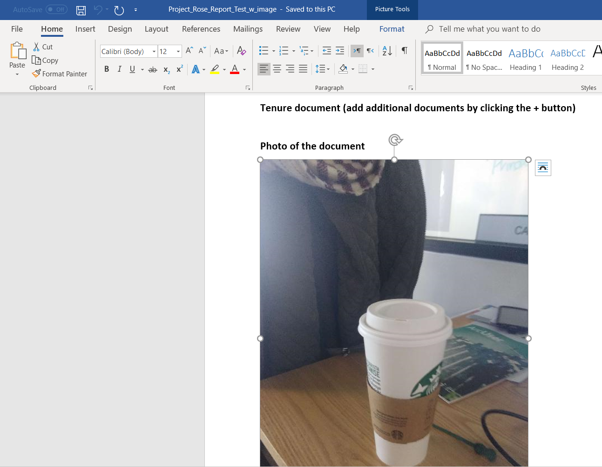

## Purpose

This page will explain how to print reports for each data item collected in your survey.

## Requirements

* You will need to create a survey created and collect data with it.

-----

## Steps

1. Navigate to [Survey123 Web](https://survey123.arcgis.com/surveys)

2. Navigate to your desired survey

3. Select your desired records
	
    *Note: Reports are limited to 30 records in one export at a time. Meaning, if you have 90 records, you will have to create three batches of 30 records for 90 reports.*

    

4. Select **Report (Beta)**

    

5. You can choose to save or not to save to your account

6. Select **Generate**

    *Note: Reports will be saved as separate document files*

    
