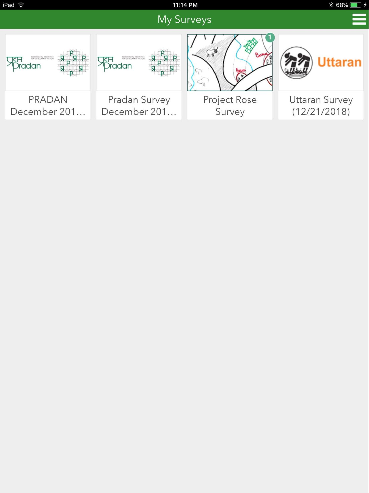
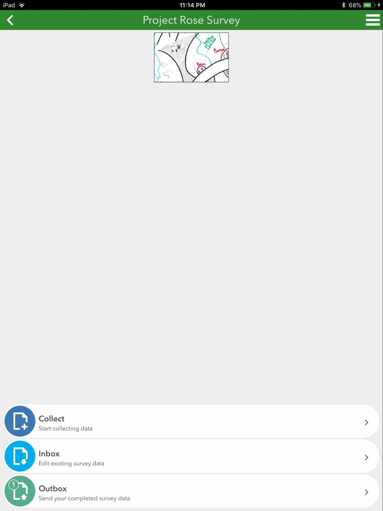
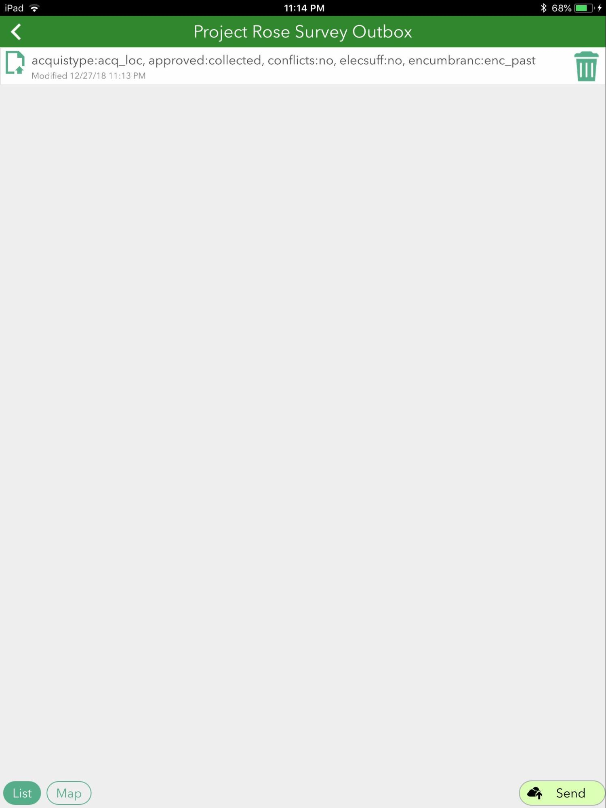

## Purpose

This page will explain how to send surveys you have created in Survey123

## Requirements

* You will need to have a username and password set up for you by a Cadasta team member. If you do not have a user please contact support@cadasta.org
* You will need to install the Survey123 app from the Google Play store or from the AppStore

-----

## Steps

1. Connect your mobile device to the internet

1. Open the Survey123 app

2. Sign in to your account if you need

3. Select your survey (this example uses Project Rose Survey)

    Note: There should be a number in the right-hand corner of the survey that reflects the amount collected offline.

    

1. Select Outbox

    

2. Select Send

    Note: You will see the collected surveys in this window. If you have collected 10 surveys, you should see 10 records. In this example, only one survey has been collected, therefore there is only one survey record in the queue. You must be connected to the internet in order to perform this last step.

    
