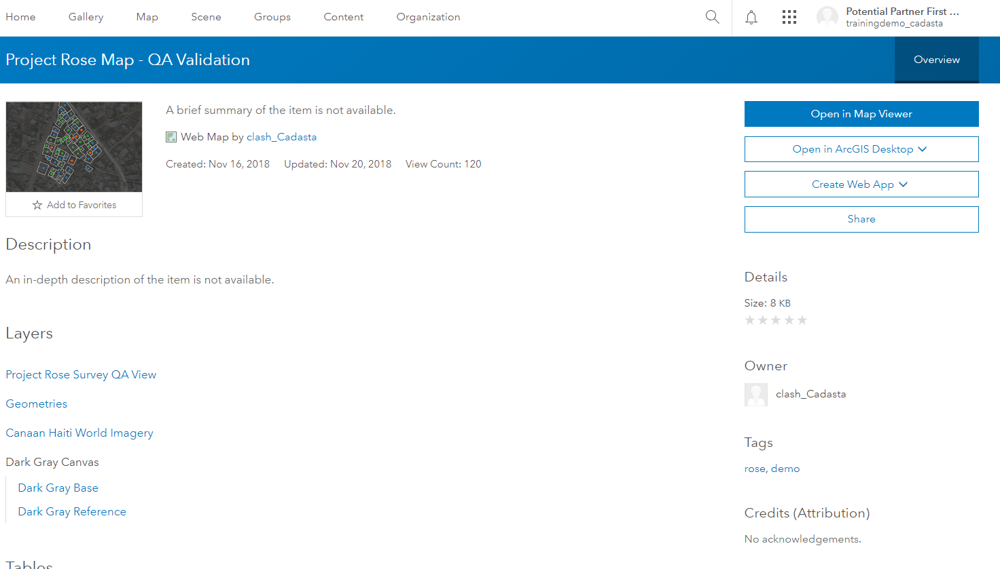
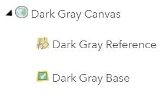
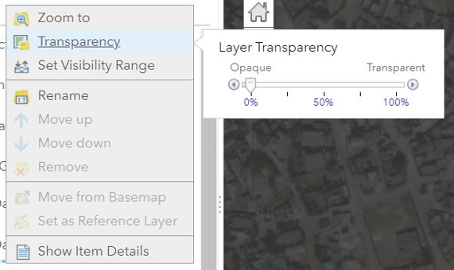
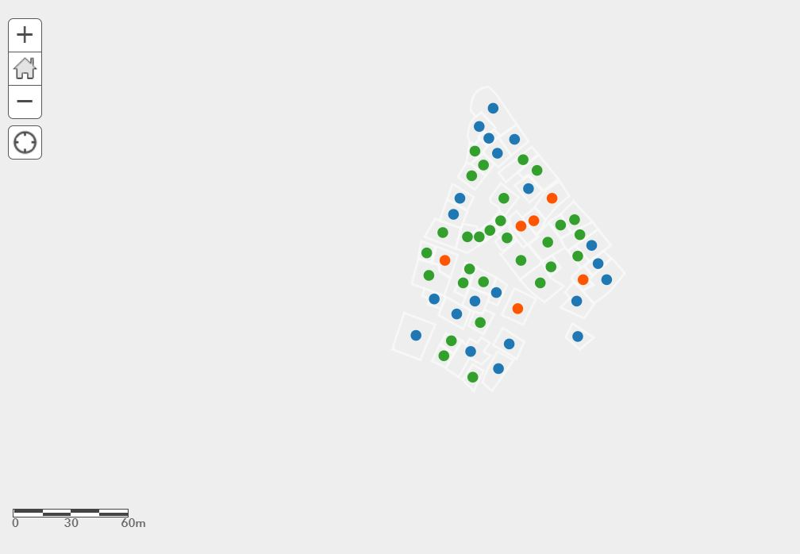
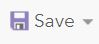

### Purpose

This page will explain how to change the transparency of the basemap in a web map in ArcGIS Online

### Requirements

- You will need to have a username and password set up for you by a Cadasta team member. If you do not have a user please contact support@cadasta.org
- You will need to sign to your account - see [Introduction to your account](intro_to_account/index.md) for a reminder

---

### Steps

1. Navigate to the desired Web Map and press the "Item Details" button

   

1. Click **Open in Map Viewer**

   

1. See the **Web Map** with a visible background image (Basemap Image Layer)

   

1. Click **Content**

   

1. Click the **Expand Arrow**

    of the Basemap Imagery Layer Group  to show the Basemap Layer(s)

   <small>Note: This example uses the Dark Gray Canvas Basemap Imagery Layer Group, which includes the Dark Gray Reference and Dark Gray Base Layers.</small>

   

1. Click **More Options**

    found under the desired layer

   <small>Note: This example shows the Dark Gray Base Layer.</small>

   

1. Click or hover your mouse over **Transparency**

   

1. Set Transparency to **100%** for any basemap imagery

1. See that there is no longer a basemap present

   

1. Click **Save**

   
