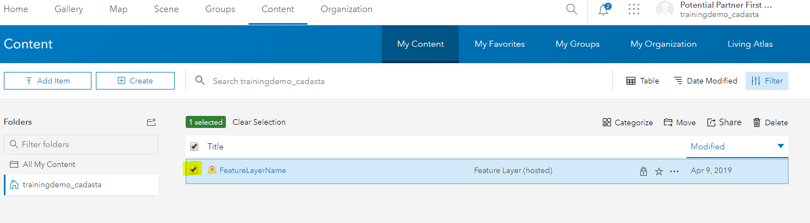

## Purpose

This page will explain how to create a new Cadasta project in ArcGIS Online (AGOL) for use with the Collector and Survey12s mobile apps.

## Requirements

- You will need to have a username and password set up for you by a Cadasta team member. If you do not have a user please contact support@cadasta.org
- You will need to sign to your account - see [Introduction to your account](intro_to_account/index.md) for a reminder
- You will need to install [Survey123 Connect for ArcGIS](https://www.esri.com/en-us/arcgis/products/survey123/resources)

---

## Steps

__**Step 1: Creating a New Feature Layer**__

1. Log in to your account in AGOL and navigate to **Content**, **My Content**:
	
 		

2. Create a new **Feature Layer** by selecting **Create**

	

3. Select **Feature Layer**

	

1. Select **Build a Layer**

	
1. Select **Polygon** and **Create**
	

1. Select **Create**
	

1. Select **Next** and **Next**

1. Enter a **Title** and make sure the **Tags** has at least the “Data Collection” tag included. Other information is optional. 
	

1. Select **Done** 

__**Step 2: Sharing a Feature Layer**__
1. Navigate to the newly created **Feature Layer** by selecting **Content**, **My Content**, and finding the new feature
_Note: Do not attempt to do this via the Feature Layer’s Item Description Page_

1. **Check** the box next to the **Feature Layer**
	

1. Select **Share**
	

1. Select **Access and update capabilities**
	

1. Select your organization’s User Group and **Check** the box

	

1. Select **OK**

__**Step 3: Creating a New Web Map**__

1. Navigate to the Map Viewer by clicking **Map** from the top bar
	

1. Select **Details** to navigate to **About, Content**, and **Legend** sections.

1. Select **Content** to view layers (and **Layer Options**)
	
	

1. Select the **Layer Options** to access **Show Legend, Show Table, Change Style, 
Filter, Perform Analysis**, and **More Options**

1. Select **Add** to add layers to a map

	_Note: There are multiple options for adding data layers to the map: Search for Layers, Browse Living Atlas Layers, Add Layer from Web, Add Layer from File, and Add Map Notes_

	

1. On the ribbon, click the **Add** button and choose **Search for Layer**

	_Note: A default list of search results appears._
 
 	

1. **Type** in the search box. Search for the newly created **Polygon Feature Layer**
   
	_Note: You are able to limit the search results._
 	

1. In the list of results, locate your search result
1. Click **Add** (or the plus icon) to add the layer to the map
	
	_Note: You can add as many layers as you would like._
 	
	 

1. At the top of the search pane, click the **Back** button.

	_Note: The layers are drawn, with their default symbols, in the order in which they were loaded into the map._
	 

1. Save your map. On the ribbon, click the **Save** button and choose **Save**.
	 
	 

12. To change or add a Basemap, **navigate** to the top of the **Details** pane and click the **Content** button.
	

1. If necessary, click the **Basemap** button on the ribbon and choose a basemap.
 
1. **Click** the **Save** button and choose **Save**.
	 
	 

__**Step 4: Sharing a Web Map for Offline Use**__

1. In the web map you created, select the **About** tab and then select the “More Details” link to open the item information page.
	 
	 

	 

 

1. Select the **Settings** tab and scroll down to the **Web Map** section. 

	 

1. Ensure that the “Use in Collector for ArcGIS” checkbox is checked. If not, check it and then press the “Save” button.
 
 

__**Step 5: Creating a Survey Form**__

1. **Open** the Survey123 Connect for ArcGIS application.

2. **Create** a new **XLSForm** (survey) in Survey123 Connect, using Excel

1. **Add** all your desired questions and choices.

1. **Navigate** to the end of your survey form in Excel

1. **Add** the following lines in the appropriate columns
	
	*Note: Copying and pasting each cell is best practice until you have a working survey template for your organization.*

	 

1. **Select Save**
2. **Publish** your survey

