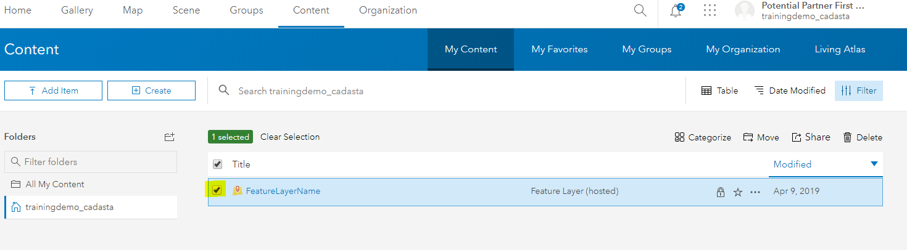
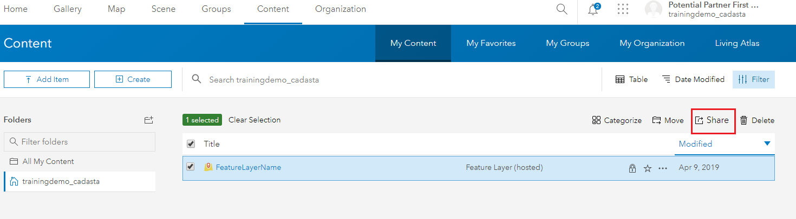

## Purpose

This page will explain how to **share a feature layer** in ArcGIS Online (AGOL) 

## Requirements

* You will need to have a feature layer that you created in AGOL.

-----

## Steps

1. Navigate to the newly created **Feature Layer** by selecting **Content**, **My Content**, and finding the new feature

    *Note: Do not attempt to do this via the Feature Layer’s Item Description Page.*

1. **Check** the box next to the **Feature Layer**

    

1. Select **Share**

    

1. Select **Access and update capabilities**

    

1. Select your organization’s User Group and **Check** the box

    

1. Select **OK**

