## Purpose

This page will explain how to use the “Project Rose” survey template for the survey you are currently doing 

## Requirements

* You must have [Survey123 Connect for ArcGIS](https://www.esri.com/en-us/arcgis/products/survey123/resources)  installed on your workstation

-----

## Steps

1. In your workstation, open the Survey123 Connect for ArcGIS application:

    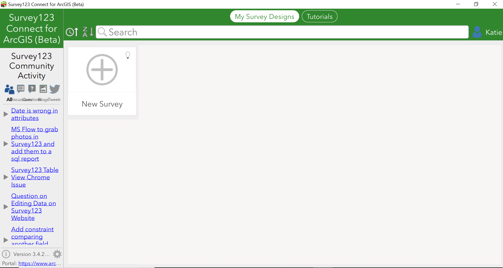

1. Give your survey a title:

    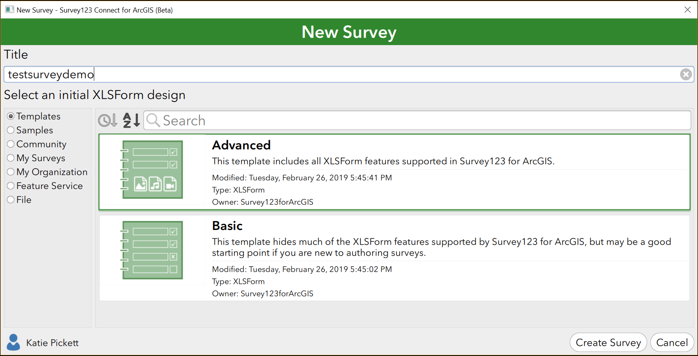

1. Select the “My Organization” option:

    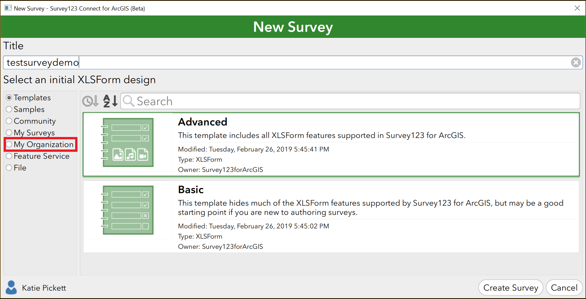

1. In the search bar, enter “project rose” to find the Project Rose template survey:

    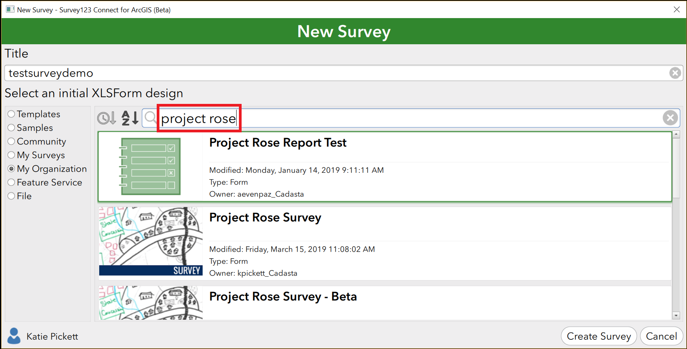

1. Select the “Project Rose Survey” template:

    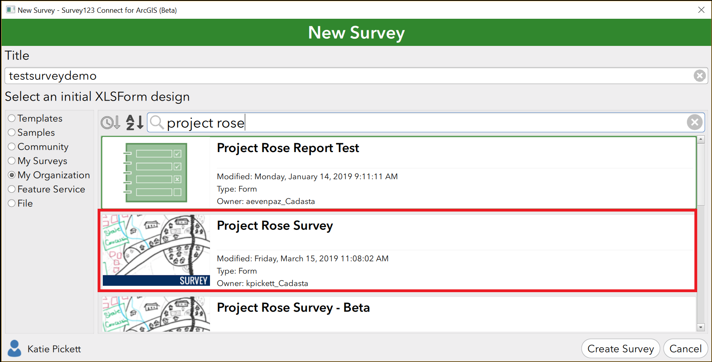

1. Press the “Create Survey” button:

    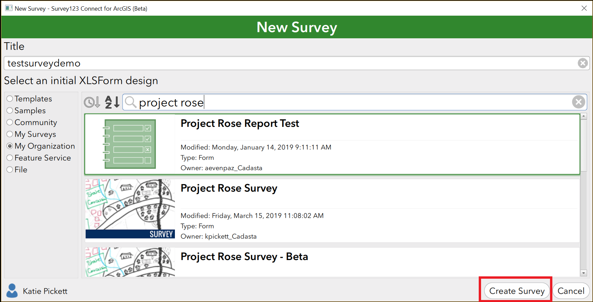

1. You should be seeing the following window:

    

1. Press the XLSForm button on the upper left:

    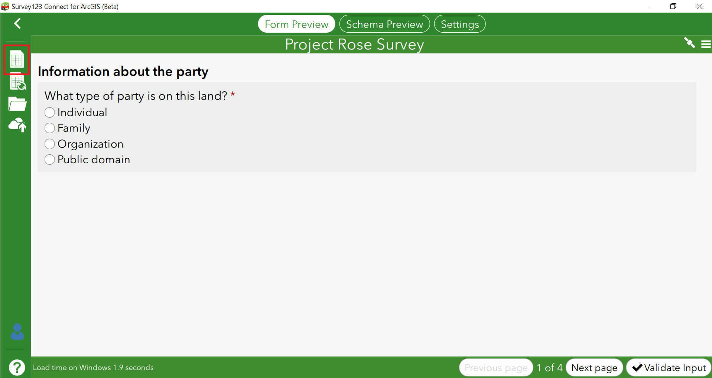

1. An XLS window with the survey should open up:

    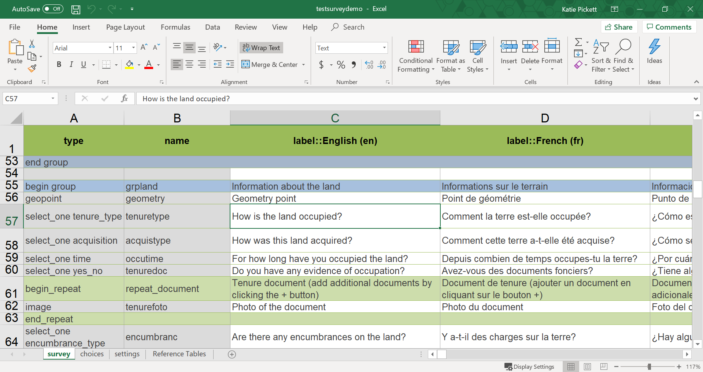

1. Make sure to save the file:

    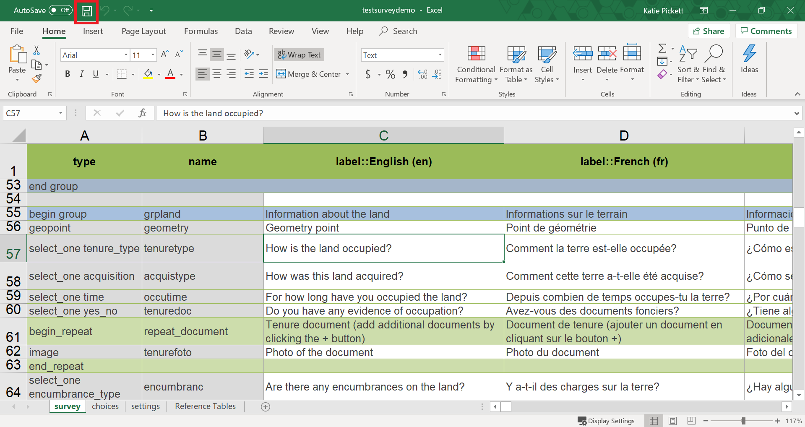

1. Make changes to your survey as needed:

    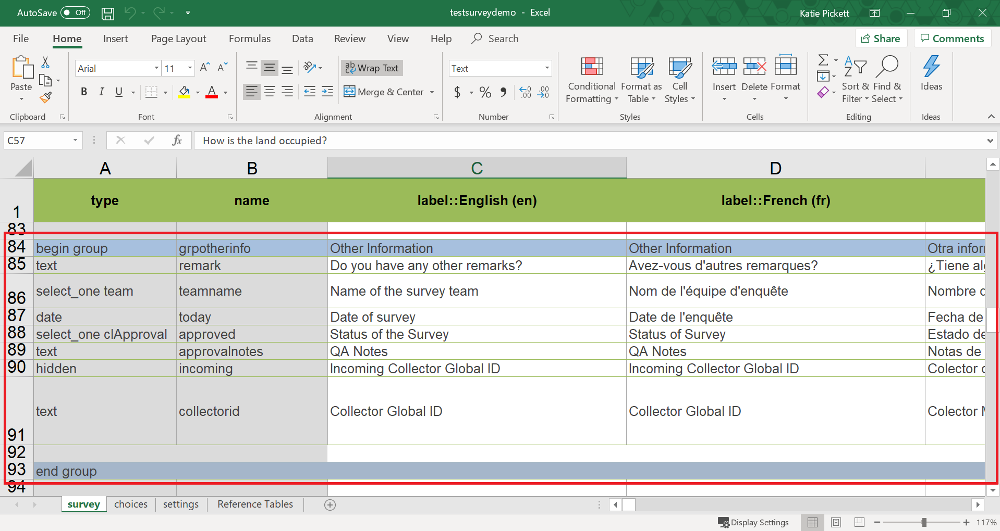

1. After you have finished making all the required changes, press the “Publish” button:

    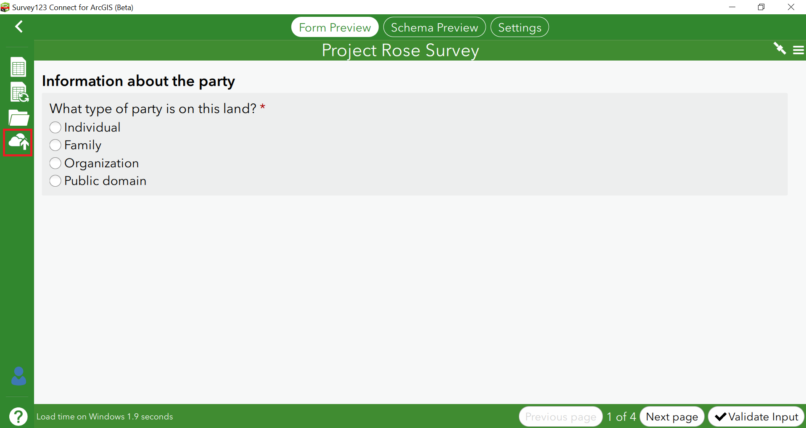

1. The survey will be available for review in AGOL in the “My Content” section. Make sure that you share the survey with your group so that other group members are able to use it. 
