1. Navigate to the **User Group** page

1. Search for or scroll to the **Web App**

3. Click on the **Web App** to navigate to the item details then click on **View Application** 
   
    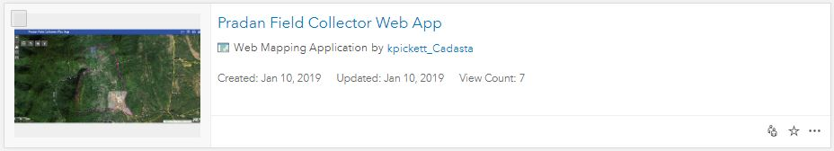
    

    **OR** 

    Open the Web App by clicking on the **thumbnail**

    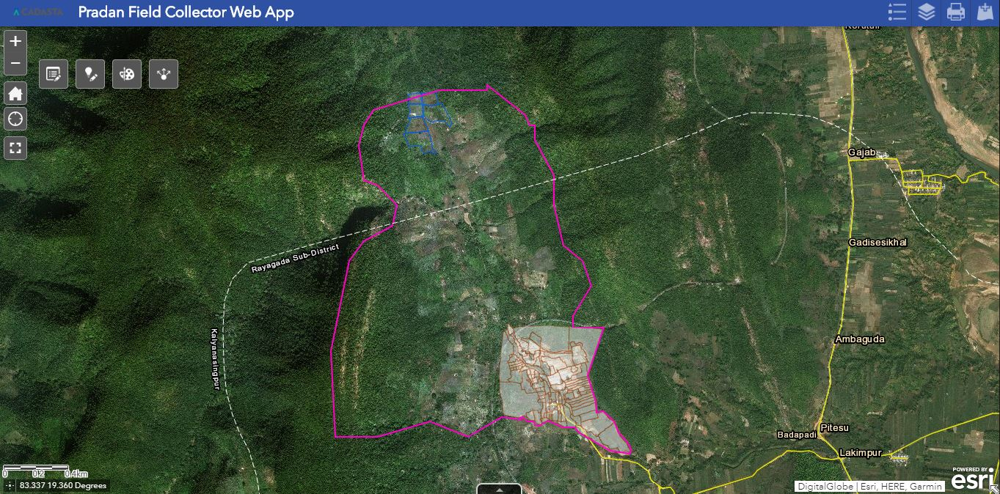

4. See the Web App

5. You can **zoom in and out**, go to the **home** location, navigate to your **current location**, and start full screen mode by using these buttons

    <small>Note: At any point you can place your mouse over any of the buttons and an 
identification pop-up will name the button</small>

1. With the **Edit** 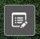 button  you can open the **Edit Widget** to add, delete, and edit features
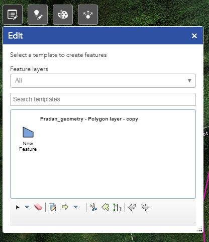

1. With the **Smart Editor**  button  you can open the **Smart Editor Widget** to create new features
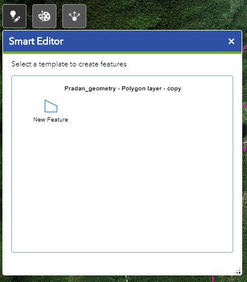

1. With the **Draw** button  you can open the **Draw Widget** to add polygons, lines, points, and text
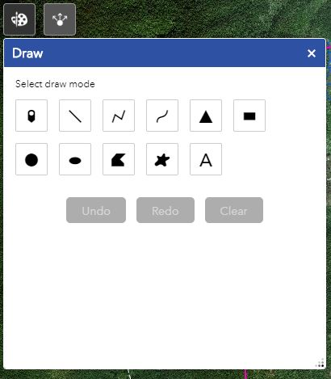

1. With the **Share**  button  you can open the **Share Widget** to email the web app link easily
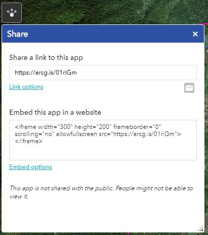

1. The scale bar looks like this and is in the left-bottom corner of the web app
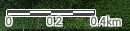

1. The attribute table can be seen by pressing **Open Attribute Table** button 
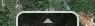
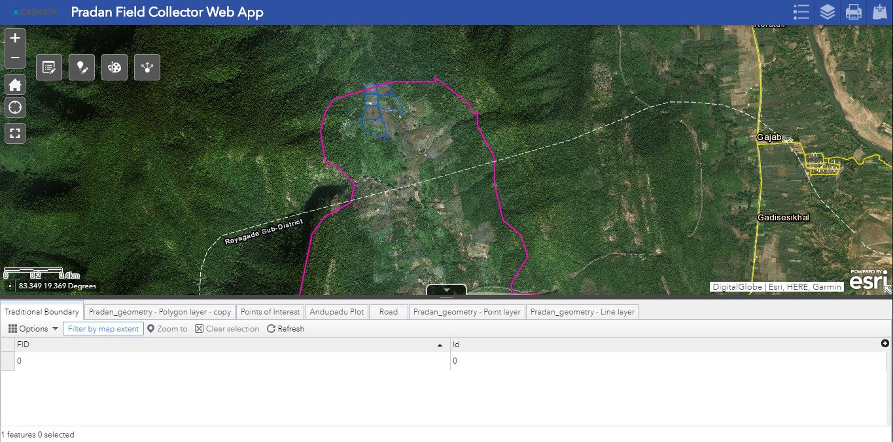

1. The **Legend** button  shows the map’s legend
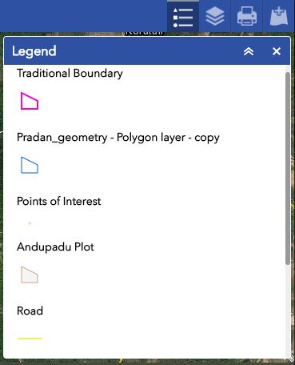

1. The **Layer list**  buttondisplays the map’s layers
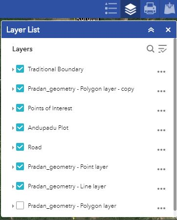 

1. The **Print** button  provides advanced map output options
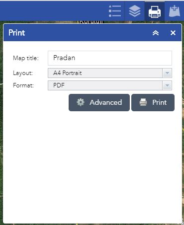

1. See the **Advanced** option for map layout options
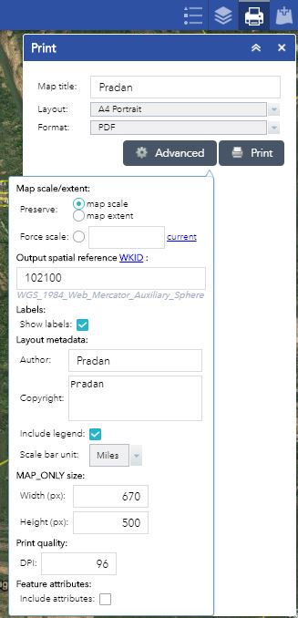

1. The **Add Data**  button  allows you to search for more layers in your User Group and to add those or others from your files to the map
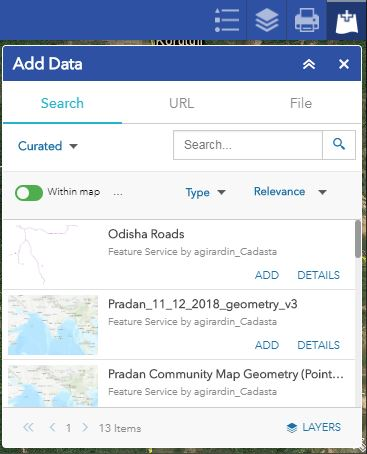

------

<b>Additional Resources</b>

[Print Widget](http://doc.arcgis.com/en/web-appbuilder/create-apps/widget-print.htm)

[Widget Overview](http://doc.arcgis.com/en/web-appbuilder/create-apps/widget-overview.htm)

